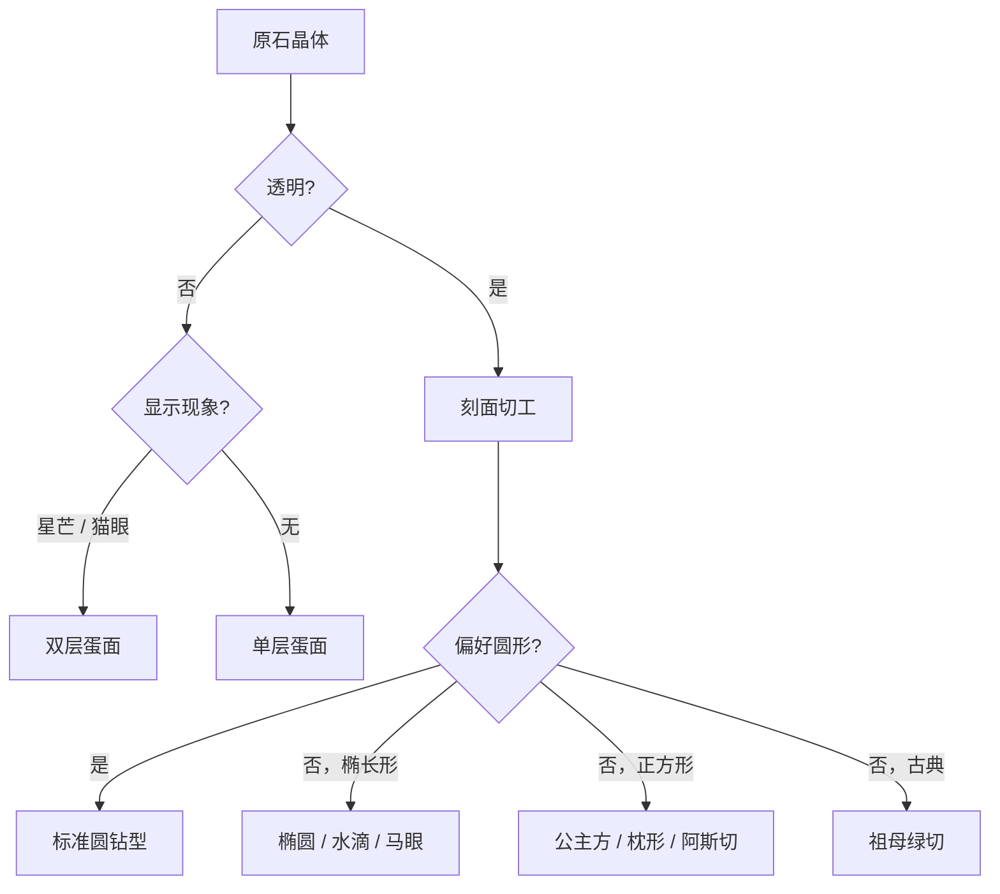

# 切割

> *光进入，光返回——我们称之为"火彩"。*

宝石切割将粗糙晶体转变为成品宝石，最大化其美丽、火彩与价值。良好的切工揭示宝石的颜色、管理内部反射、保护免受损伤。

## 切割类型

| 类型 | 描述 | 典型宝石 |
|------|------|---------|
| **刻面切** | 平面抛光面反射光线 | 透明宝石（钻石、蓝宝石、祖母绿） |
| **蛋面切** | 光滑圆顶，无刻面 | 不透明/半透明宝石（欧泊、绿松石、星光蓝宝石） |
| **雕刻切** | 具象或抽象雕塑 | 翡翠、珊瑚、石英 |
| **圆珠切** | 抛光圆形或异形球 | 珍珠、青金石、琥珀 |

## 标准圆钻型

宝石学中研究和优化最多的切割。其比例经过调校，最大化光线从冠部返回，最小化从亭部泄漏。

<FacetDiagram locale="zh" />

**关键比例（Tolkowsky 理想）：**
- 总深度：腰部直径的 62-62.5%
- 冠角：34-35°
- 亭角：40.75-41.2°
- 台面：腰部直径的 53-60%

## 异形切割

八种将明亮式切割概念适配于不同美学的形状：

<FancyCutGrid locale="zh" />

## 蛋面切

蛋面（或称 cab）是光滑的圆顶宝石，常见三种形状：

| 形状 | 剖面 | 用途 |
|------|------|------|
| **单层蛋面** | 单一圆顶 | 大多数蛋面（欧泊、绿松石） |
| **双层蛋面** | 圆顶+平底 | 星光石、猫眼金绿宝石 |
| **高拱蛋面** | 高圆顶剖面 | 展示星芒效应 |

蛋面适用于以下情况：
- 宝石不透明或半透明（无法通过刻面增加光线返回）
- 宝石显示星芒或猫眼（现象需曲面）
- 偏好光滑触感而非闪耀

## 浮雕与凹雕

| 类型 | 风格 | 传统材质 |
|------|------|---------|
| **浮雕（Cameo）** | 凸起浮雕（图形凸出） | 贝壳、玛瑙 |
| **凹雕（Intaglio）** | 凹刻于表面 | 红玉髓、缟玛瑙 |

自古以来作为个人印章、珠宝和装饰品。

## 选择切割方式

切割方式取决于原石的特性：

## 切割流程

刻面宝石经历多个阶段：

1. **规划** — 根据内含物和形状在原石上标记
2. **锯切** — 将原石切分为可处理的小块
3. **粗磨** — 在粗砂轮上塑形
4. **预成型** — 粗略形成基本形状
5. **刻面** — 抛光单个刻面（每颗石可能耗时数小时）
6. **最终抛光** — 所有刻面达到镜面光泽

现代刻面机自动化控制刻面角度，精度达 0.1°。