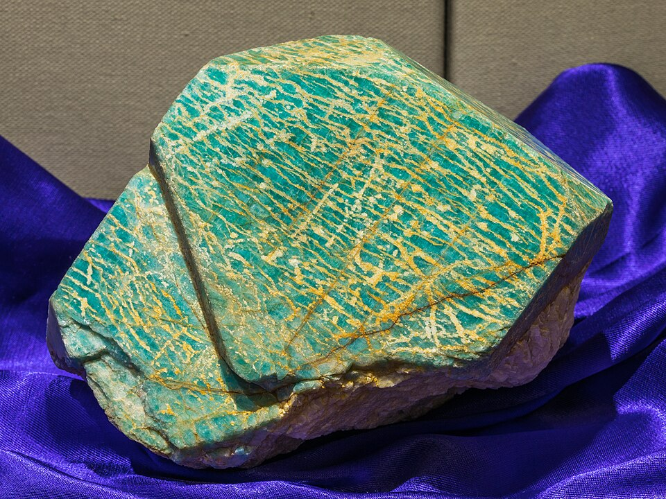
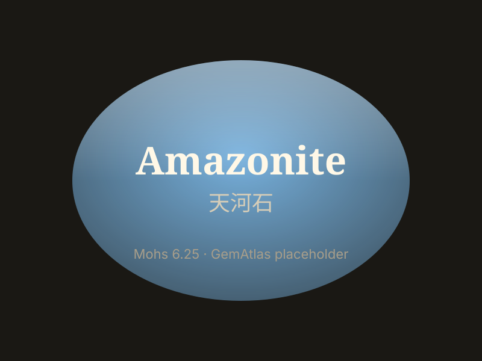

# 天河石

> 长石族

<!-- language switcher hint -->
English: [Amazonite](/gems/amazonite)

---

## 分类

| 属性 | 值 |
|---|---|
| 矿物族 | 长石族 |
| 化学式 | KAlSi₃O₈ |
| 晶系 | triclinic |

## 物理性质

| 属性 | 值 |
|---|---|
| 莫氏硬度 | 6.25 |
| 比重 | 2.56 |
| 折射率 | 1.518-1.530 |

## 光学性质

| 属性 | 值 |
|---|---|
| 多色性 | weak |
| 典型颜色 | 蓝绿色, 翠绿色, 淡蓝色 |
| 致色原因 | Pb²⁺ 取代 K⁺ 致蓝绿色；含 Rb/Cs |

## 处理与披露

| 处理方式 | 详情 |
|---------|------|
| 常见方法 | wax-impregnation, dyeing |
| 需披露 | 是 |
| 备注 | 以俄羅斯米阿斯（Miass）和美国派克斯峰（Pikes Peak）著名 |

## 图库

