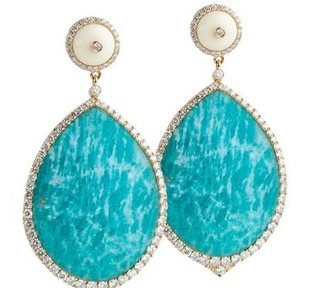

<a href="./">宝石名录</a>/天河石

  

    
GEM ATLAS / 03

    <h1 id="gem-detail-title-amazonite">天河石Amazonite</h1>
    
矿物身份长石族

    <dl class="gem-detail__identity-facts">
      
<dt>化学式</dt><dd>KAlSi₃O₈</dd>

      
<dt>晶系</dt><dd>三斜晶系</dd>

    </dl>
    <dl class="gem-detail__quick-facts">
      
<dt>硬度</dt><dd>6.25</dd>

      
<dt>比重</dt><dd>2.56</dd>

      
<dt>折射率</dt><dd>1.518-1.530</dd>

    </dl>
    <a class="gem-detail__language" href="../../gems/amazonite.html" hreflang="en">English: Amazonite ↗</a>
  

  <figure class="gem-detail__hero-media"><figcaption>主视图视觉识别</figcaption></figure>

## 分类

身份 / 宝石档案

<table class="gem-detail__table">
  <thead><tr><th scope="col">属性</th><th scope="col">值</th></tr></thead>
  <tbody><tr><th scope="row">矿物族</th><td>长石族</td></tr><tr><th scope="row">化学式</th><td>KAlSi₃O₈</td></tr><tr><th scope="row">晶系</th><td>三斜晶系</td></tr></tbody>
</table>

## 物理性质

<table class="gem-detail__table">
  <thead><tr><th scope="col">属性</th><th scope="col">值</th></tr></thead>
  <tbody><tr><th scope="row">莫氏硬度</th><td>6.25</td></tr><tr><th scope="row">比重</th><td>2.56</td></tr><tr><th scope="row">折射率</th><td>1.518-1.530</td></tr></tbody>
</table>

## 光学性质

<table class="gem-detail__table">
  <thead><tr><th scope="col">属性</th><th scope="col">值</th></tr></thead>
  <tbody><tr><th scope="row">多色性</th><td>弱</td></tr><tr><th scope="row">典型颜色</th><td>蓝绿色、翠绿色、淡蓝色</td></tr><tr><th scope="row">致色原因</th><td>Pb²⁺ 取代 K⁺ 致蓝绿色；含 Rb/Cs</td></tr></tbody>
</table>

## 处理与披露

  
常见处理<strong>蜡浸渍、染色</strong>

  
需要披露<strong class="is-required">是</strong>

  
说明以俄羅斯米阿斯（Miass）和美国派克斯峰（Pikes Peak）著名

## 产地记录

代表性产地<ul><li>巴西</li><li>美国科罗拉多</li><li>俄罗斯</li><li>马达加斯加</li></ul>

## 历史与传说

天河石以亚马孙河命名（实为讹传），蓝绿棋盘格纹独特，古埃及用作饰品。 

## 图像证据

<figure><figcaption>证据 01</figcaption></figure>
<figure><figcaption>证据 02</figcaption></figure>
<figure><figcaption>证据 03</figcaption></figure>

继续阅读<i aria-hidden="true">/</i><small>CONTINUE EXPLORING</small>

<nav class="gem-detail__pager" aria-label="宝石记录导航">
<a class="gem-detail__pager-link gem-detail__pager-link--previous" href="./garnet-almandine.html" aria-label="上一颗 铁铝榴石"><i aria-hidden="true">←</i>上一颗<strong>铁铝榴石</strong><small>Almandine (Garnet)</small></a>
<a class="gem-detail__pager-index" href="./" aria-label="返回宝石名录">返回名录<strong>03 / 60</strong><small>全部宝石</small></a>
<a class="gem-detail__pager-link gem-detail__pager-link--next" href="./amber.html" aria-label="下一颗 琥珀">下一颗<strong>琥珀</strong><small>Amber</small><i aria-hidden="true">→</i></a>
</nav>

