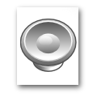
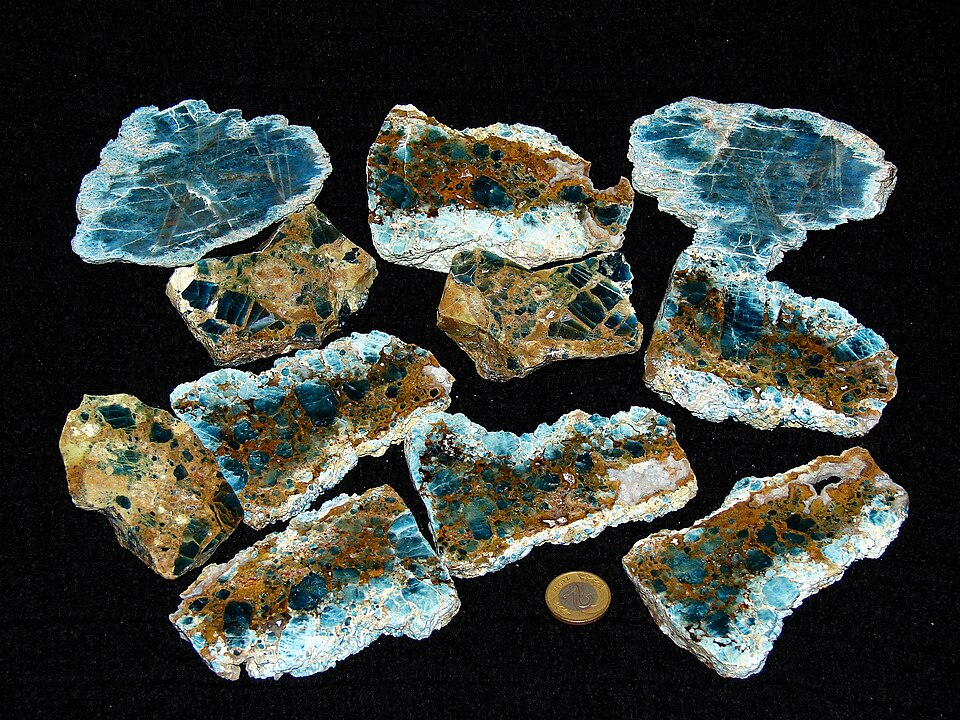
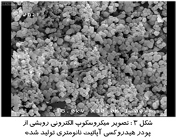

# 磷灰石

> 磷酸盐

<!-- language switcher hint -->
English: [Apatite](/gems/apatite)

---

## 分类

| 属性 | 值 |
|---|---|
| 矿物族 | 磷酸盐 |
| 化学式 | Ca₅(PO₄)₃(F,OH,Cl) |
| 晶系 | hexagonal |

## 物理性质

| 属性 | 值 |
|---|---|
| 莫氏硬度 | 5（软——少见刻面） |
| 比重 | 3.17 |
| 折射率 | 1.63-1.65 |

## 光学性质

| 属性 | 值 |
|---|---|
| 多色性 | weak |
| 典型颜色 | 帕拉伊巴蓝, 薄荷绿, 黄 |
| 致色原因 | 稀土致帕拉伊巴蓝 |

## 处理与披露

| 处理方式 | 详情 |
|---------|------|
| 常见方法 | 无 / 通常无处理 |
| 需披露 | 否 |
| 备注 | 产地位于缅甸的帕拉伊巴蓝磷灰石最受藏家青睐 |

## 主要产地

| 产地 |
|---|
| 缅甸 |
| 马达加斯加 |
| 巴西 |
| 墨西哥 |

## 历史与传说

磷灰石是人体骨骼与牙齿的主要成分，因颜色酷似帕拉伊巴碧玺而受关注。

## 图库

