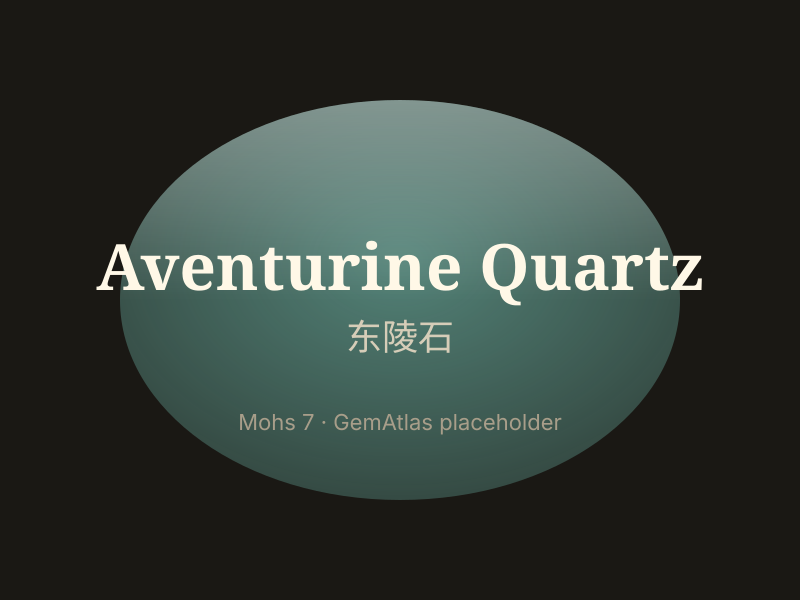

# 东陵石 / 砂金石

> 石英族

<!-- language switcher hint -->
English: [Aventurine Quartz](/gems/aventurine-quartz)

---

## 分类

| 属性 | 值 |
|---|---|
| 矿物族 | 石英族 |
| 化学式 | SiO₂ + Cr-mica / hematite |
| 晶系 | trigonal |

## 物理性质

| 属性 | 值 |
|---|---|
| 莫氏硬度 | 7 |
| 比重 | 2.64 |
| 折射率 | 1.544-1.553 |

## 光学性质

| 属性 | 值 |
|---|---|
| 多色性 | none |
| 典型颜色 | 绿色, 红棕色, 蓝色 |
| 致色原因 | 绿色：铬云母包裹体；红棕色：赤铁矿包裹体 |

## 处理与披露

| 处理方式 | 详情 |
|---------|------|
| 常见方法 | dyeing |
| 需披露 | 是 |
| 备注 | 商业蓝色变种多为染色产物；绿色最常见，源自印度市场 |

## 图库

