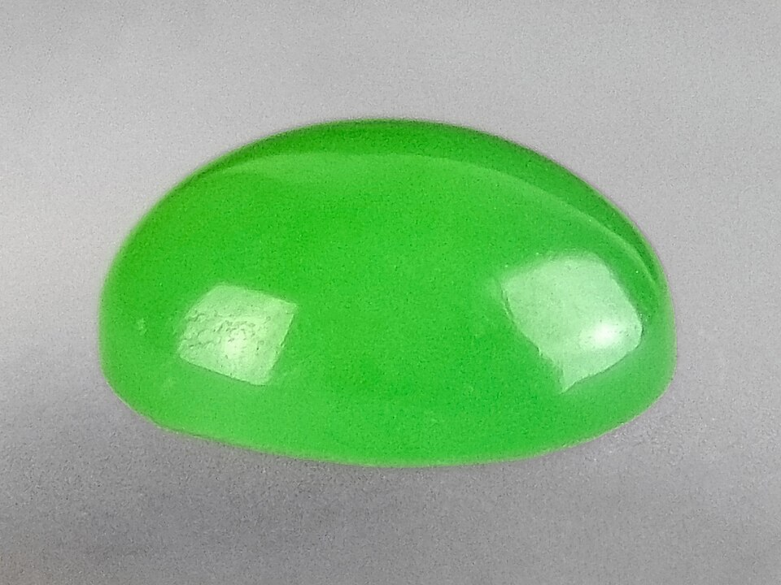
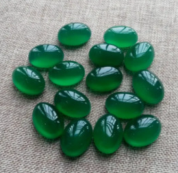
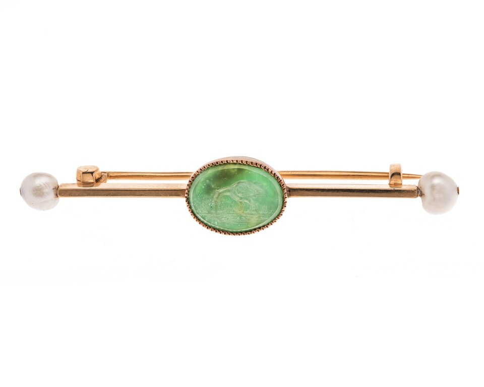
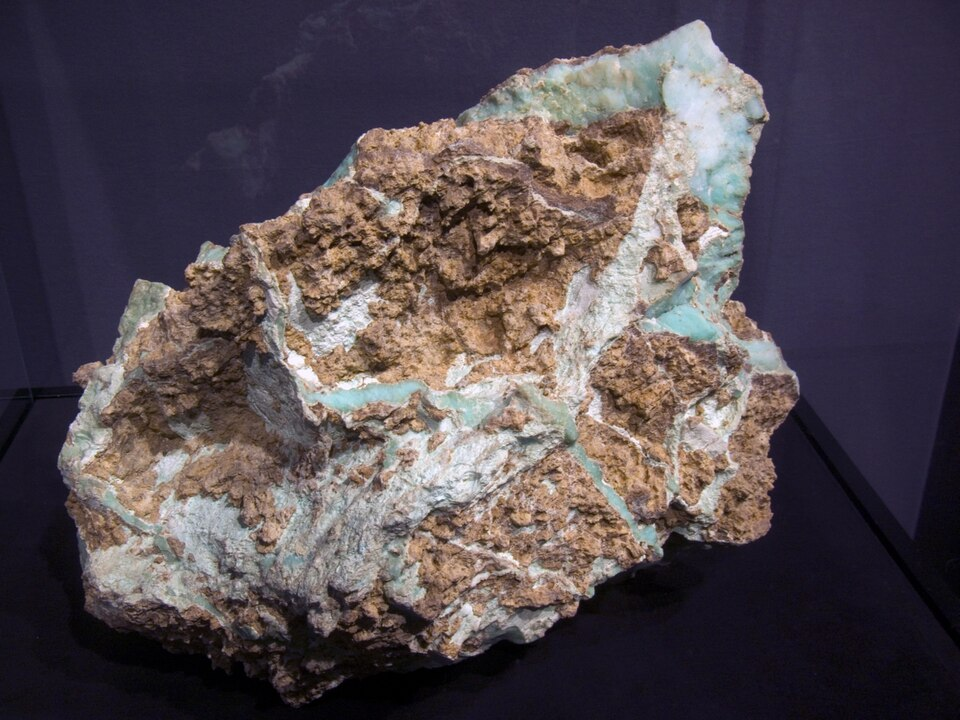

# 绿玉髓

> 石英族（隐晶质）

<!-- language switcher hint -->
English: [Chrysoprase](/gems/chrysoprase)

---

## 分类

| 属性 | 值 |
|---|---|
| 矿物族 | 石英族（隐晶质） |
| 化学式 | SiO₂ + Ni |
| 晶系 | trigonal |

## 物理性质

| 属性 | 值 |
|---|---|
| 莫氏硬度 | 7 |
| 比重 | 2.6 |
| 折射率 | 1.530-1.543 |

## 光学性质

| 属性 | 值 |
|---|---|
| 多色性 | none |
| 典型颜色 | 苹果绿, 翠绿色, 薄荷绿 |
| 致色原因 | Ni²⁺ 包裹体或 Ni 替代 Si 致绿色 |

## 处理与披露

| 处理方式 | 详情 |
|---------|------|
| 常见方法 | wax-impregnation |
| 需披露 | 是 |
| 备注 | 颜色在长时间日晒下可能褪色；与染色绿玛瑙不同 |

## 主要产地

| 产地 |
|---|
| 澳大利亚昆士兰 |
| 波兰 |
| 美国加州 |

## 历史与传说

绿玉髓的苹果绿由镍致色，是半透明石英中最珍贵者，普鲁士腓特烈大帝曾收藏。

## 图库

