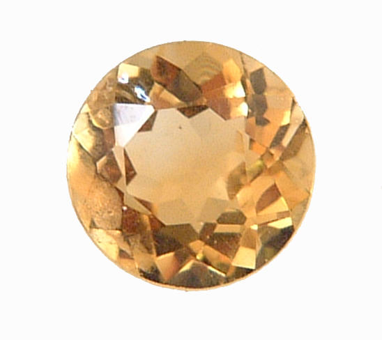
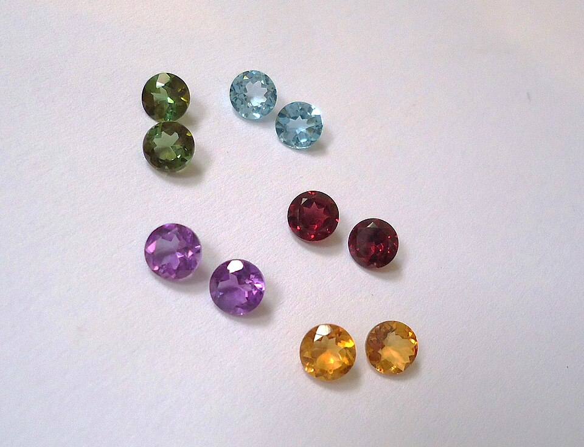
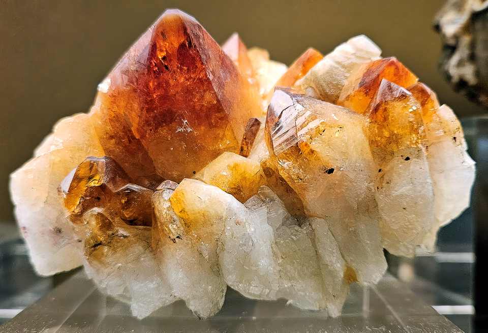
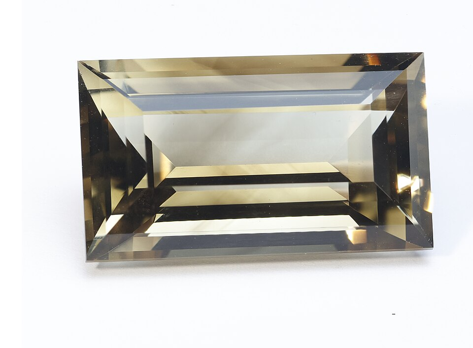

# 黄水晶

> 石英族

<!-- language switcher hint -->
English: [Citrine](/gems/citrine)

---

## 分类

| 属性 | 值 |
|---|---|
| 矿物族 | 石英族 |
| 化学式 | SiO₂ |
| 晶系 | trigonal |

## 物理性质

| 属性 | 值 |
|---|---|
| 莫氏硬度 | 7 |
| 比重 | 2.65 |
| 折射率 | 1.544-1.553 |

## 光学性质

| 属性 | 值 |
|---|---|
| 多色性 | none |
| 典型颜色 | 淡黄色, 蜂蜜黄, 烟褐色 |
| 致色原因 | Fe³⁺ 色心致色 |

## 处理与披露

| 处理方式 | 详情 |
|---------|------|
| 常见方法 | heat-treatment |
| 需披露 | 是 |
| 备注 | 市售黄水晶多数为紫水晶加热产物 |

## 图库

