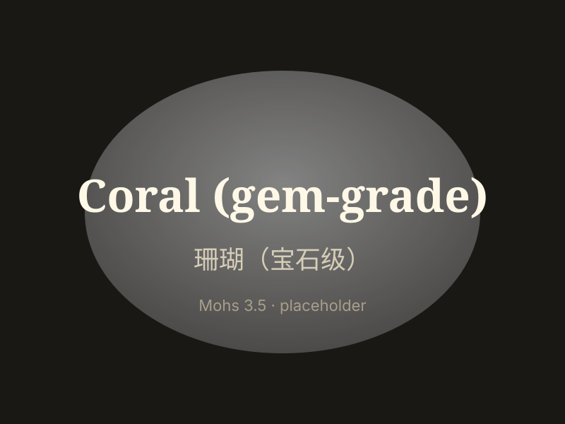

# 珊瑚（宝石级）

> 有机宝石（珊瑚虫骨骼）

<!-- language switcher hint -->
English: [Coral (gem-grade)](/gems/coral)

---

## 分类

| 属性 | 值 |
|---|---|
| 矿物族 | 有机宝石（珊瑚虫骨骼） |
| 化学式 | CaCO₃ (calcite) |
| 晶系 | amorphous |

## 物理性质

| 属性 | 值 |
|---|---|
| 莫氏硬度 | 3.5（软） |
| 比重 | 2.65 |
| 折射率 | 1.49-1.66 |

## 光学性质

| 属性 | 值 |
|---|---|
| 多色性 | none |
| 典型颜色 | 血红（阿卡）, 粉色（momo）, 白色, 天使皮 |
| 致色原因 | 铁/有机色素 |

## 处理与披露

| 处理方式 | 详情 |
|---------|------|
| 常见方法 | waxing, dyeing |
| 需披露 | 是 |
| 备注 | 深血红日本阿卡珊瑚最贵；忌酸与高温 |

## 主要产地

| 产地 |
|---|
| 日本 |
| 地中海 |
| 中国台湾 |
| 夏威夷 |

## 历史与传说

珊瑚自古用于宗教与王室饰品，古罗马称其可避雷。日本阿卡珊瑚在明清中国极受追捧。

## 图库

