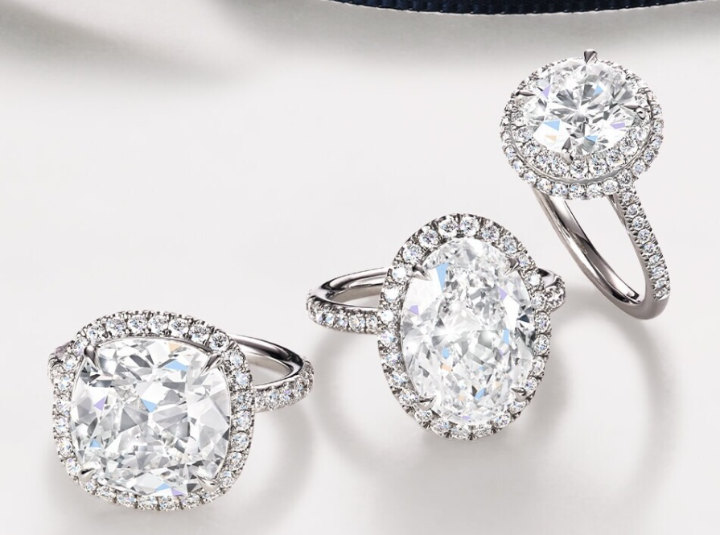
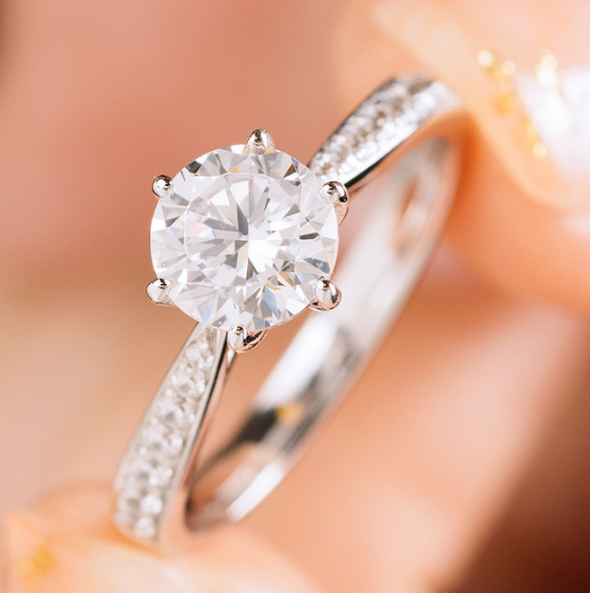
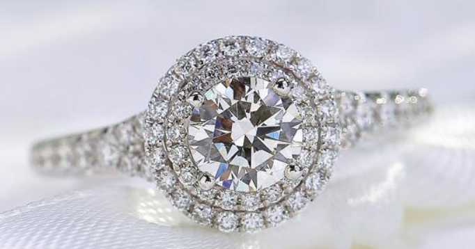

# 钻石

> 金刚石

<!-- language switcher hint -->
English: [Diamond](/gems/diamond)

---

## 分类

| 属性 | 值 |
|---|---|
| 矿物族 | 金刚石 |
| 化学式 | C |
| 晶系 | cubic |

## 物理性质

| 属性 | 值 |
|---|---|
| 莫氏硬度 | 10（自然界最硬） |
| 比重 | 3.52 |
| 折射率 | 2.417-2.419 |

## 光学性质

| 属性 | 值 |
|---|---|
| 多色性 | — |
| 典型颜色 | 无色, 彩黄 |
| 致色原因 | 无色纯净；黄色由 N 原子致色 |

## 处理与披露

| 处理方式 | 详情 |
|---------|------|
| 常见方法 | high-pressure-high-temperature |
| 需披露 | 是 |
| 备注 | HPHT 处理需披露；天然与合成需激光刻印区分 |

## 主要产地

| 产地 |
|---|
| 印度（戈尔康达） |
| 南非 |
| 俄罗斯（雅库特） |
| 博茨瓦纳 |

## 历史与传说

钻石之名的"永恒"意象源于其硬度。戈尔康达矿区出产无数传奇名钻（Hope、Regent）；1866年南非金伯利发现改变了供应格局。

## 图库

