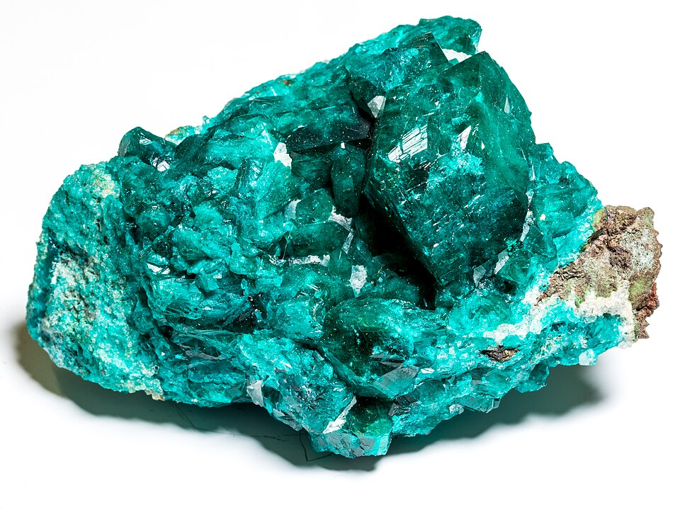
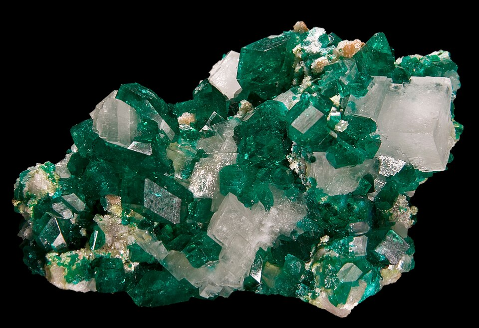
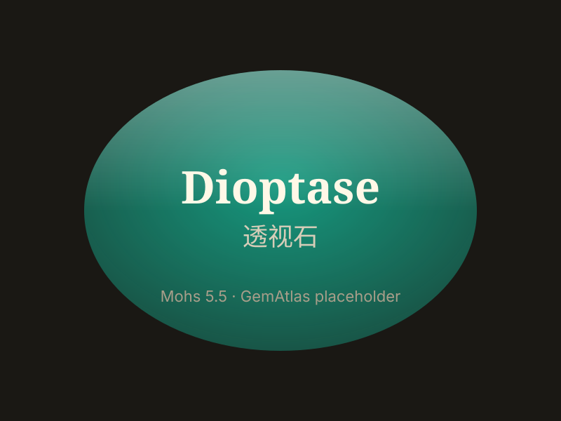

# 透视石

> 硅酸盐（环状）

<!-- language switcher hint -->
English: [Dioptase](/gems/dioptase)

---

## 分类

| 属性 | 值 |
|---|---|
| 矿物族 | 硅酸盐（环状） |
| 化学式 | CuSiO₂(OH)₂  [Cu₆Si₆O₁₈·6H₂O] |
| 晶系 | trigonal |

## 物理性质

| 属性 | 值 |
|---|---|
| 莫氏硬度 | 5.5 |
| 比重 | 3.3 |
| 折射率 | 1.644-1.709 |

## 光学性质

| 属性 | 值 |
|---|---|
| 多色性 | weak |
| 典型颜色 | 翠绿色，极高饱和度, 蓝绿色 |
| 致色原因 | Cu²⁺ 致鲜艳翠绿 |

## 处理与披露

| 处理方式 | 详情 |
|---------|------|
| 常见方法 | 无 / 通常无处理 |
| 需披露 | 否 |
| 备注 | 颜色与祖母绿相似但更艳；硬度较低（5.5），不适合日常佩戴 |

## 图库

