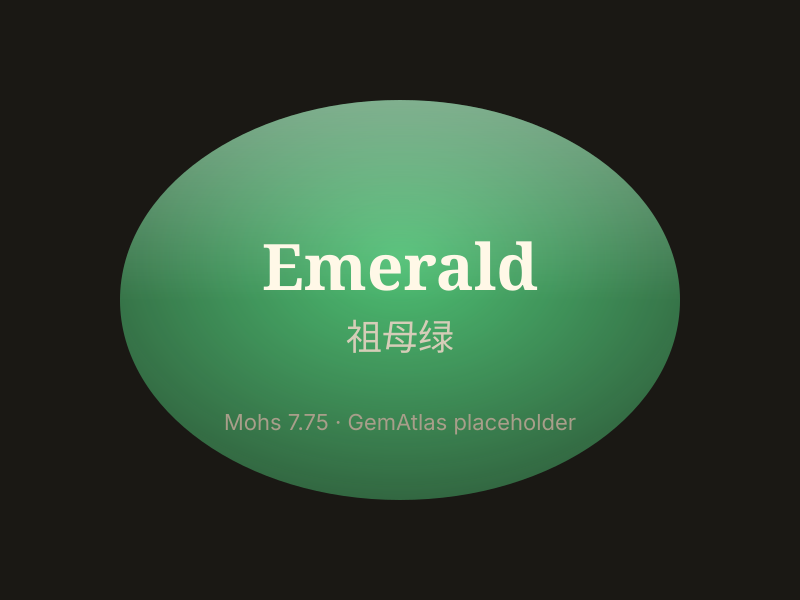

# 祖母绿

> 绿柱石族

<!-- language switcher hint -->
English: [Emerald](/gems/emerald)

---

## 分类

| 属性 | 值 |
|---|---|
| 矿物族 | 绿柱石族 |
| 化学式 | Be₃Al₂Si₆O₁₈ |
| 晶系 | hexagonal |

## 物理性质

| 属性 | 值 |
|---|---|
| 莫氏硬度 | 7.75（性脆，避免撞击） |
| 比重 | 2.72 |
| 折射率 | 1.577-1.583 |

## 光学性质

| 属性 | 值 |
|---|---|
| 多色性 | weak |
| 典型颜色 | 木佐绿, 哥伦比亚绿 |
| 致色原因 | Cr³⁺ 与 V³⁺ 离子致色 |

## 处理与披露

| 处理方式 | 详情 |
|---------|------|
| 常见方法 | cedar-oil-filling |
| 需披露 | 是 |
| 备注 | 注油（雪松油）属行业可接受处理；无油溢价显著 |

## 图库

