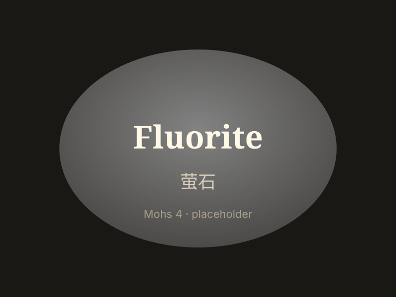

# 萤石

> 卤化物（氟化钙）

<!-- language switcher hint -->
English: [Fluorite](/gems/fluorite)

---

## 分类

| 属性 | 值 |
|---|---|
| 矿物族 | 卤化物（氟化钙） |
| 化学式 | CaF₂ |
| 晶系 | cubic |

## 物理性质

| 属性 | 值 |
|---|---|
| 莫氏硬度 | 4（软——作雕件或刻面收藏） |
| 比重 | 3.18 |
| 折射率 | 1.43 |

## 光学性质

| 属性 | 值 |
|---|---|
| 多色性 | weak |
| 典型颜色 | 紫, 绿, 黄, 蓝, 彩虹 |
| 致色原因 | 稀土与色心 |

## 处理与披露

| 处理方式 | 详情 |
|---------|------|
| 常见方法 | irradiation |
| 需披露 | 否 |
| 备注 | "彩虹萤石"具强荧光；玻璃仿品常见 |

## 主要产地

| 产地 |
|---|
| 中国 |
| 墨西哥 |
| 南非 |
| 英国德比郡 |

## 历史与传说

萤石因荧光现象得名（最早被记录荧光的矿物），色彩之丰居矿物之冠。

## 图库

