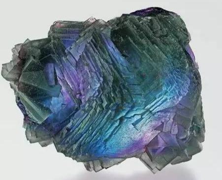
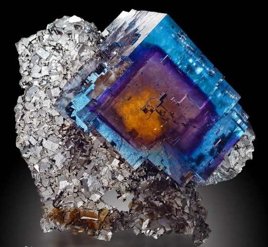
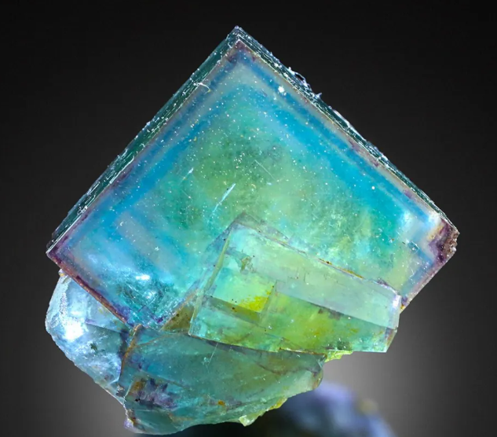
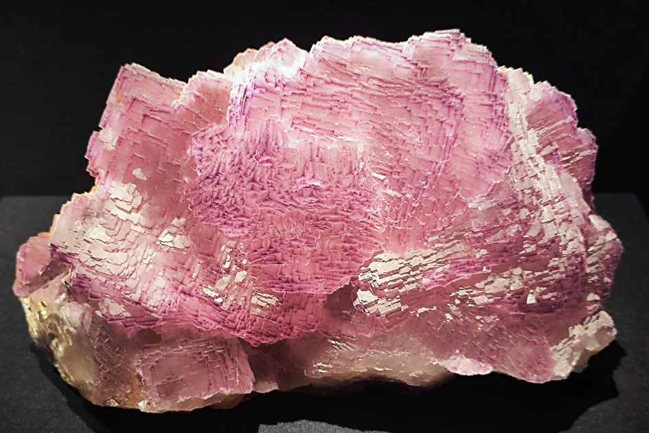

<a href="./">宝石名录</a>/萤石

  

    
GEM ATLAS / 19

    <h1 id="gem-detail-title-fluorite">萤石Fluorite</h1>
    
矿物身份卤化物（氟化钙）

    <dl class="gem-detail__identity-facts">
      
<dt>化学式</dt><dd>CaF₂</dd>

      
<dt>晶系</dt><dd>立方晶系</dd>

    </dl>
    <dl class="gem-detail__quick-facts">
      
<dt>硬度</dt><dd>4</dd>

      
<dt>比重</dt><dd>3.18</dd>

      
<dt>折射率</dt><dd>1.43</dd>

    </dl>
    <a class="gem-detail__language" href="../../gems/fluorite.html" hreflang="en">English: Fluorite ↗</a>
  

  <figure class="gem-detail__hero-media"><figcaption>主视图视觉识别</figcaption></figure>

## 分类

身份 / 宝石档案

<table class="gem-detail__table">
  <thead><tr><th scope="col">属性</th><th scope="col">值</th></tr></thead>
  <tbody><tr><th scope="row">矿物族</th><td>卤化物（氟化钙）</td></tr><tr><th scope="row">化学式</th><td>CaF₂</td></tr><tr><th scope="row">晶系</th><td>立方晶系</td></tr></tbody>
</table>

## 物理性质

<table class="gem-detail__table">
  <thead><tr><th scope="col">属性</th><th scope="col">值</th></tr></thead>
  <tbody><tr><th scope="row">莫氏硬度</th><td>4（软——作雕件或刻面收藏）</td></tr><tr><th scope="row">比重</th><td>3.18</td></tr><tr><th scope="row">折射率</th><td>1.43</td></tr></tbody>
</table>

## 光学性质

<table class="gem-detail__table">
  <thead><tr><th scope="col">属性</th><th scope="col">值</th></tr></thead>
  <tbody><tr><th scope="row">多色性</th><td>弱</td></tr><tr><th scope="row">典型颜色</th><td>紫、绿、黄、蓝、彩虹</td></tr><tr><th scope="row">致色原因</th><td>稀土与色心</td></tr></tbody>
</table>

## 处理与披露

  
常见处理<strong>辐照</strong>

  
需要披露<strong class="">否</strong>

  
说明&quot;彩虹萤石&quot;具强荧光；玻璃仿品常见

## 产地记录

代表性产地<ul><li>中国</li><li>墨西哥</li><li>南非</li><li>英国德比郡</li></ul>

## 历史与传说

萤石因荧光现象得名（最早被记录荧光的矿物），色彩之丰居矿物之冠。 

## 图像证据

<figure><figcaption>证据 01</figcaption></figure>
<figure><figcaption>证据 02</figcaption></figure>
<figure><figcaption>证据 03</figcaption></figure>

继续阅读<i aria-hidden="true">/</i><small>CONTINUE EXPLORING</small>

<nav class="gem-detail__pager" aria-label="宝石记录导航">
<a class="gem-detail__pager-link gem-detail__pager-link--previous" href="./emerald.html" aria-label="上一颗 祖母绿"><i aria-hidden="true">←</i>上一颗<strong>祖母绿</strong><small>Emerald</small></a>
<a class="gem-detail__pager-index" href="./" aria-label="返回宝石名录">返回名录<strong>19 / 60</strong><small>全部宝石</small></a>
<a class="gem-detail__pager-link gem-detail__pager-link--next" href="./heliodor.html" aria-label="下一颗 金绿柱石（金绿玉）">下一颗<strong>金绿柱石（金绿玉）</strong><small>Heliodor (golden beryl)</small><i aria-hidden="true">→</i></a>
</nav>

