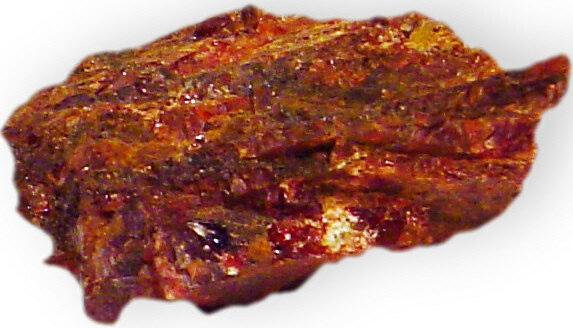
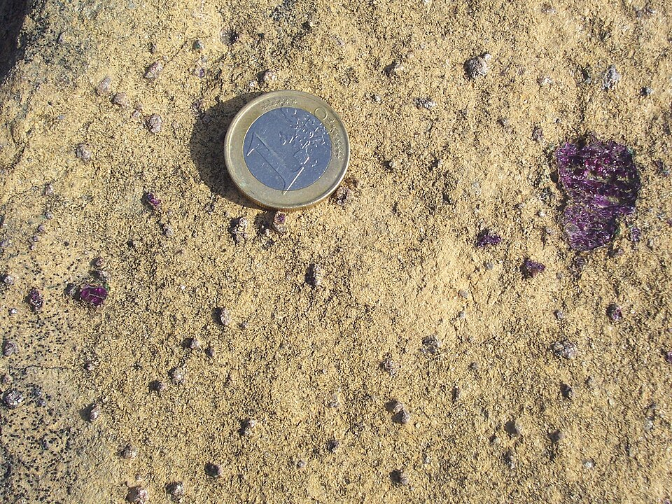

# 镁铝榴石

> 石榴石族

<!-- language switcher hint -->
English: [Pyrope (Garnet)](/gems/garnet-pyrope)

---

## 分类

| 属性 | 值 |
|---|---|
| 矿物族 | 石榴石族 |
| 化学式 | Mg₃Al₂(SiO₄)₃ |
| 晶系 | cubic |

## 物理性质

| 属性 | 值 |
|---|---|
| 莫氏硬度 | 7.25 |
| 比重 | 3.78 |
| 折射率 | 1.714-1.940 |

## 光学性质

| 属性 | 值 |
|---|---|
| 多色性 | none |
| 典型颜色 | 深红色, 紫红色, 玫瑰红 |
| 致色原因 | Fe²⁺ 微量致深红（无 Fe 几乎无色） |

## 处理与披露

| 处理方式 | 详情 |
|---------|------|
| 常见方法 | 无 / 通常无处理 |
| 需披露 | 否 |
| 备注 | 著名"波西米亚石榴石"多为镁铝-铁铝榴石混合体 |

## 主要产地

| 产地 |
|---|
| 捷克波西米亚 |
| 南非 |
| 坦桑尼亚 |

## 历史与传说

镁铝榴石深红近黑，波西米亚自古开采，欧洲古墓中常见其珠饰。

## 图库

