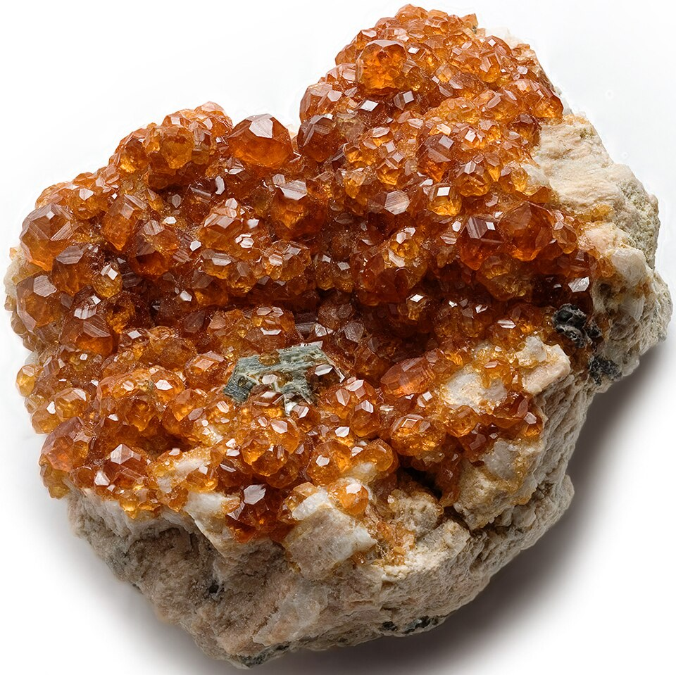

# 锰铝榴石

> 石榴石族

<!-- language switcher hint -->
English: [Spessartine (Garnet)](/gems/garnet-spessartine)

---

## 分类

| 属性 | 值 |
|---|---|
| 矿物族 | 石榴石族 |
| 化学式 | Mn₃Al₂(SiO₄)₃ |
| 晶系 | cubic |

## 物理性质

| 属性 | 值 |
|---|---|
| 莫氏硬度 | 7.25 |
| 比重 | 4.16 |
| 折射率 | 1.790-1.820 |

## 光学性质

| 属性 | 值 |
|---|---|
| 多色性 | none |
| 典型颜色 | 橙黄色, 橘红色, 芬达色 |
| 致色原因 | Mn²⁺ 致橙黄至橘红 |

## 处理与披露

| 处理方式 | 详情 |
|---------|------|
| 常见方法 | 无 / 通常无处理 |
| 需披露 | 否 |
| 备注 | 著名"芬达石"为含 Fe 的锰铝榴石 |

## 主要产地

| 产地 |
|---|
| 中国新疆 |
| 纳米比亚 |
| 马达加斯加 |
| 美国 |

## 历史与传说

锰铝榴石（芬达石）呈亮橙色，近年因独特荧光橙而受热捧。

## 图库

