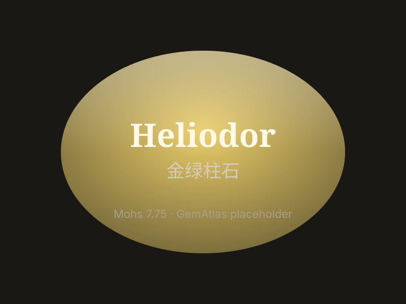

# 金绿柱石（金绿玉）

> 绿柱石族

<!-- language switcher hint -->
English: [Heliodor (golden beryl)](/gems/heliodor)

---

## 分类

| 属性 | 值 |
|---|---|
| 矿物族 | 绿柱石族 |
| 化学式 | Be₃Al₂(SiO₃)₆ |
| 晶系 | hexagonal |

## 物理性质

| 属性 | 值 |
|---|---|
| 莫氏硬度 | 7.75 |
| 比重 | 2.7 |
| 折射率 | 1.57-1.58 |

## 光学性质

| 属性 | 值 |
|---|---|
| 多色性 | weak |
| 典型颜色 | 金黄, 黄绿 |
| 致色原因 | Fe³⁺ 致金黄 |

## 处理与披露

| 处理方式 | 详情 |
|---------|------|
| 常见方法 | 无 / 通常无处理 |
| 需披露 | 否 |
| 备注 | 绿柱石家族的黄色成员，加热可改善色调 |

## 主要产地

| 产地 |
|---|
| 纳米比亚 |
| 巴西 |
| 马达加斯加 |
| 乌克兰 |

## 历史与传说

金绿柱石因希腊太阳神赫利俄斯得名，非洲产出的金黄晶体最受藏家欢迎。

## 图库

