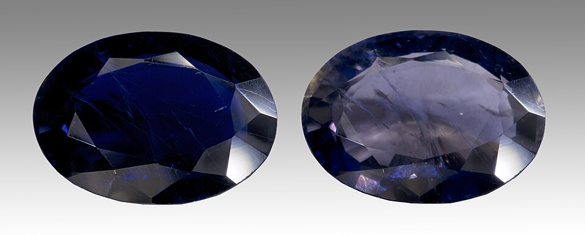
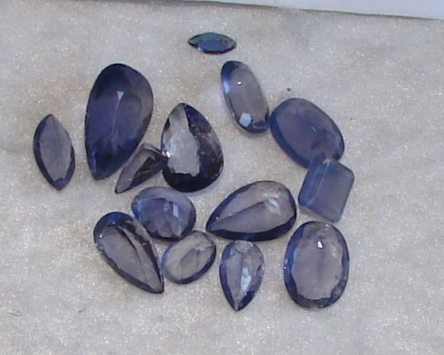
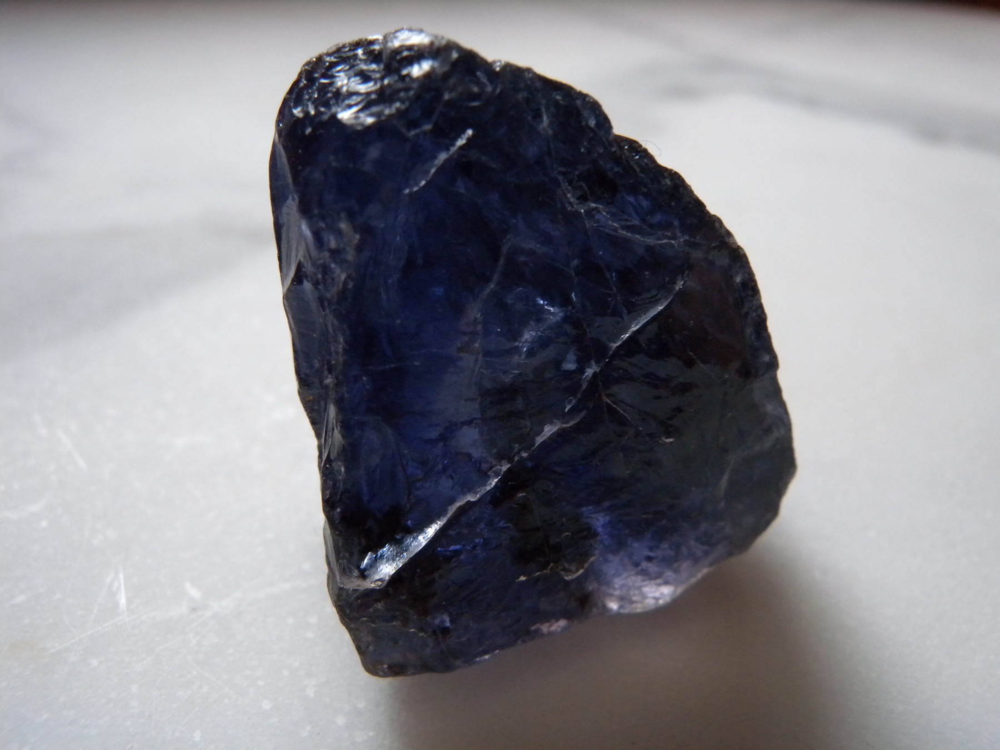
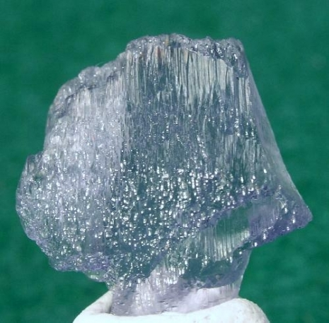

# 堇青石

> 堇青石族

<!-- language switcher hint -->
English: [Iolite](/gems/iolite)

---

## 分类

| 属性 | 值 |
|---|---|
| 矿物族 | 堇青石族 |
| 化学式 | Mg₂Al₄Si₅O₁₈ |
| 晶系 | orthorhombic |

## 物理性质

| 属性 | 值 |
|---|---|
| 莫氏硬度 | 7.25 |
| 比重 | 2.6 |
| 折射率 | 1.522-1.578 |

## 光学性质

| 属性 | 值 |
|---|---|
| 多色性 | strong |
| 典型颜色 | 紫蓝色, 蓝紫色, 灰蓝色 |
| 致色原因 | Fe²⁺ 致色，强三色性（不同方向显示不同色） |

## 处理与披露

| 处理方式 | 详情 |
|---------|------|
| 常见方法 | 无 / 通常无处理 |
| 需披露 | 否 |
| 备注 | 无已知优化处理；维京人曾用作偏振导航仪 |

## 主要产地

| 产地 |
|---|
| 印度 |
| 斯里兰卡 |
| 马达加斯加 |
| 坦桑尼亚 |

## 历史与传说

堇青石因强三色性被维京航海家用作偏振罗盘，又称"水蓝宝石"。

## 图库

