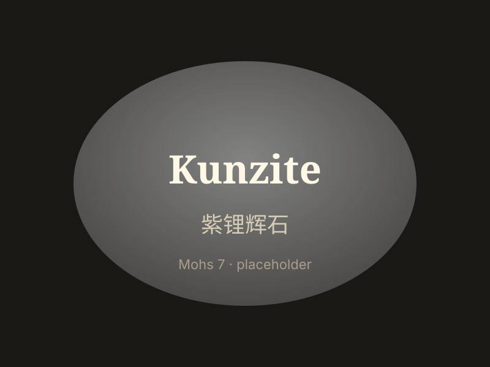
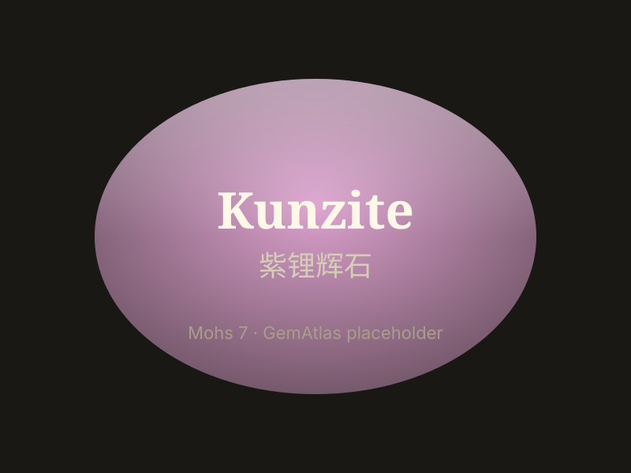

# 紫锂辉石

> 锂辉石（spodumene）

<!-- language switcher hint -->
English: [Kunzite](/gems/kunzite)

---

## 分类

| 属性 | 值 |
|---|---|
| 矿物族 | 锂辉石（spodumene） |
| 化学式 | LiAlSi₂O₆ |
| 晶系 | monoclinic |

## 物理性质

| 属性 | 值 |
|---|---|
| 莫氏硬度 | 7 |
| 比重 | 3.18 |
| 折射率 | 1.66-1.68 |

## 光学性质

| 属性 | 值 |
|---|---|
| 多色性 | strong |
| 典型颜色 | 淡紫粉, 薰衣草紫 |
| 致色原因 | Mn³⁺ 致色 |

## 处理与披露

| 处理方式 | 详情 |
|---------|------|
| 常见方法 | irradiation |
| 需披露 | 是 |
| 备注 | 1902年以宝石学家 G.F. Kunz 命名；颜色日久会褪，需避强光 |

## 主要产地

| 产地 |
|---|
| 阿富汗 |
| 巴西 |
| 马达加斯加 |
| 美国加州 |

## 历史与传说

紫锂辉石1902年由蒂芙尼宝石学家 Kunz 命名，粉色系宝石中的后起之秀。

## 图库

