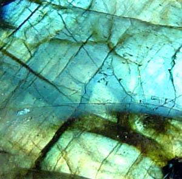

# 拉长石

> 长石族

<!-- language switcher hint -->
English: [Labradorite](/gems/labradorite)

---

## 分类

| 属性 | 值 |
|---|---|
| 矿物族 | 长石族 |
| 化学式 | (Ca,Na)(Si,Al)₄O₈ |
| 晶系 | triclinic |

## 物理性质

| 属性 | 值 |
|---|---|
| 莫氏硬度 | 6.25 |
| 比重 | 2.7 |
| 折射率 | 1.560-1.572 |

## 光学性质

| 属性 | 值 |
|---|---|
| 多色性 | none |
| 典型颜色 | 灰蓝色带晕彩, 暗灰色带蓝/绿闪, 光谱色 |
| 致色原因 | 纳米级成分层状结构产生干涉色（见光学现象-拉长晕彩） |

## 处理与披露

| 处理方式 | 详情 |
|---------|------|
| 常见方法 | surface-coating |
| 需披露 | 是 |
| 备注 | 拉长石的晕彩是结构效应，不可人造优化 |

## 主要产地

| 产地 |
|---|
| 加拿大拉布拉多 |
| 马达加斯加 |
| 芬兰 |

## 历史与传说

拉长石拉长光（labradorescence）由层状双晶干涉产生。芬兰变种称"光谱石"。

## 图库

