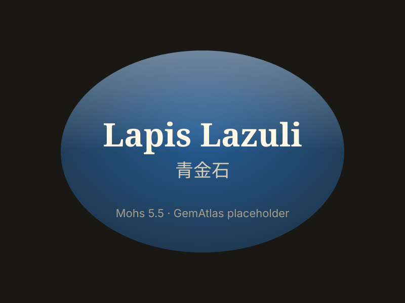

# 青金石

> 青金石族（岩石）

<!-- language switcher hint -->
English: [Lapis Lazuli](/gems/lapis-lazuli)

---

## 分类

| 属性 | 值 |
|---|---|
| 矿物族 | 青金石族（岩石） |
| 化学式 | (Na,Ca)₈(AlSiO₄)₆(S,SO₄,Cl)₂ |
| 晶系 | cubic |

## 物理性质

| 属性 | 值 |
|---|---|
| 莫氏硬度 | 5.5 |
| 比重 | 2.85 |
| 折射率 | 1.500-1.500 |

## 光学性质

| 属性 | 值 |
|---|---|
| 多色性 | none |
| 典型颜色 | 深蓝色（帝王蓝）, 天蓝色, 蓝紫色 |
| 致色原因 | 硫离子 S₃⁻ 色心致深蓝色 |

## 处理与披露

| 处理方式 | 详情 |
|---------|------|
| 常见方法 | wax-impregnation, dyeing |
| 需披露 | 是 |
| 备注 | 优质品含少量金色黄铁矿斑点（"星辉"）；阿富汗为最著名产地 |

## 图库

