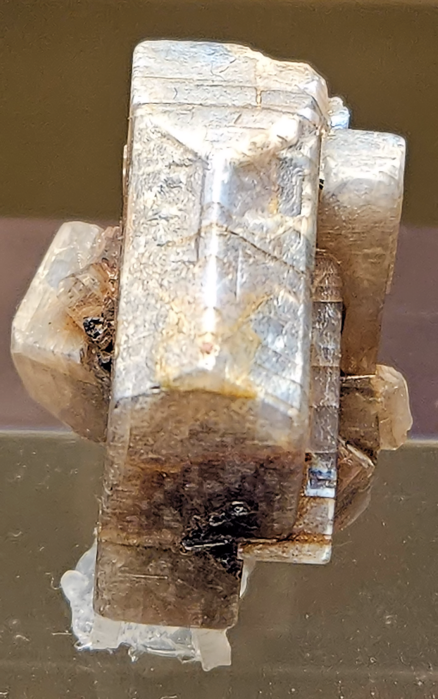

# 月光石

> 长石族

<!-- language switcher hint -->
English: [Moonstone](/gems/moonstone)

---

## 分类

| 属性 | 值 |
|---|---|
| 矿物族 | 长石族 |
| 化学式 | (K,Na)AlSi₃O₈ (with albite lamellae) |
| 晶系 | monoclinic |

## 物理性质

| 属性 | 值 |
|---|---|
| 莫氏硬度 | 6.25 |
| 比重 | 2.57 |
| 折射率 | 1.518-1.530 |

## 光学性质

| 属性 | 值 |
|---|---|
| 多色性 | none |
| 典型颜色 | 白色带蓝光, 白色带银光, 白色带彩光 |
| 致色原因 | 钠长石/正长石层状散射（见光学现象-月光效应） |

## 处理与披露

| 处理方式 | 详情 |
|---------|------|
| 常见方法 | wax-impregnation, surface-coating |
| 需披露 | 是 |
| 备注 | 薄层间隙充填可改善月光效应 |

## 图库

