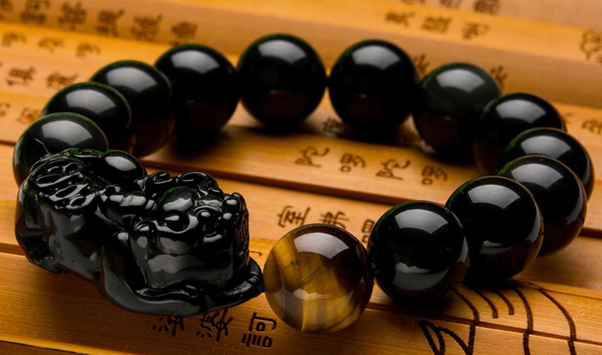
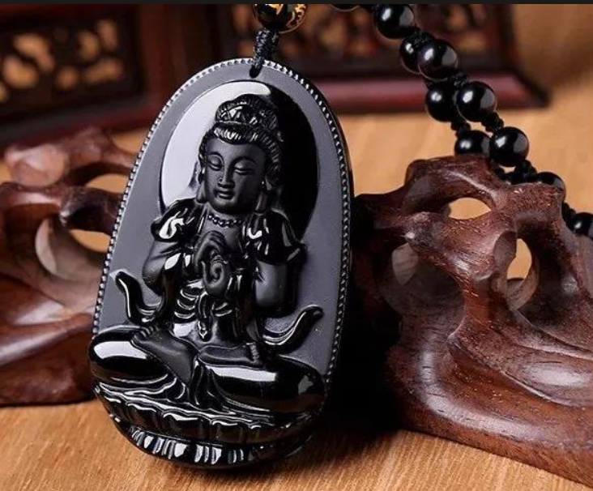
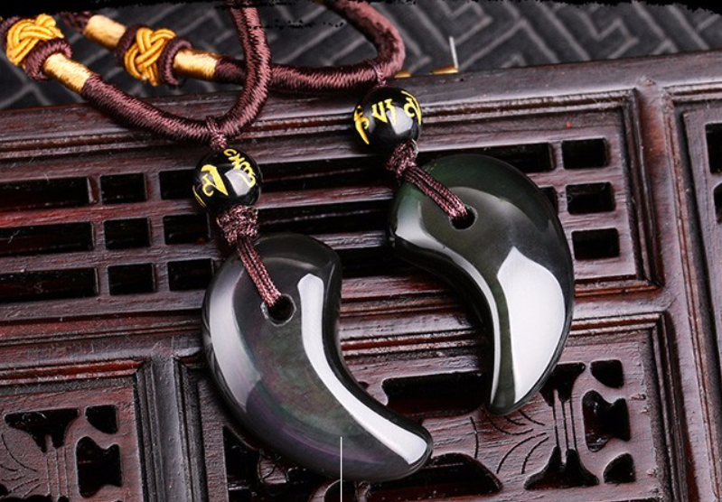

# 黑曜石

> 火山玻璃

<!-- language switcher hint -->
English: [Obsidian](/gems/obsidian)

---

## 分类

| 属性 | 值 |
|---|---|
| 矿物族 | 火山玻璃 |
| 化学式 | SiO₂ (amorphous) |
| 晶系 | amorphous |

## 物理性质

| 属性 | 值 |
|---|---|
| 莫氏硬度 | 5.5 |
| 比重 | 2.4 |
| 折射率 | 1.48-1.51 |

## 光学性质

| 属性 | 值 |
|---|---|
| 多色性 | none |
| 典型颜色 | 黑色, 棕色（马胡卡）, 银色/金色（银曜/金曜）, 彩虹色 |
| 致色原因 | 微量 Fe/Mg 致黑；气泡/微晶层致虹彩 |

## 处理与披露

| 处理方式 | 详情 |
|---------|------|
| 常见方法 | heat-treatment |
| 需披露 | 否 |
| 备注 | 天然玻璃，非矿物晶体；加热可改善银曜/金曜效果 |

## 主要产地

| 产地 |
|---|
| 美国俄勒冈 |
| 墨西哥 |
| 冰岛 |
| 日本北海道 |

## 历史与传说

黑曜石是火山玻璃，阿兹特克文明用之制刃与镜。彩虹/银曜为特殊变种。

## 图库

