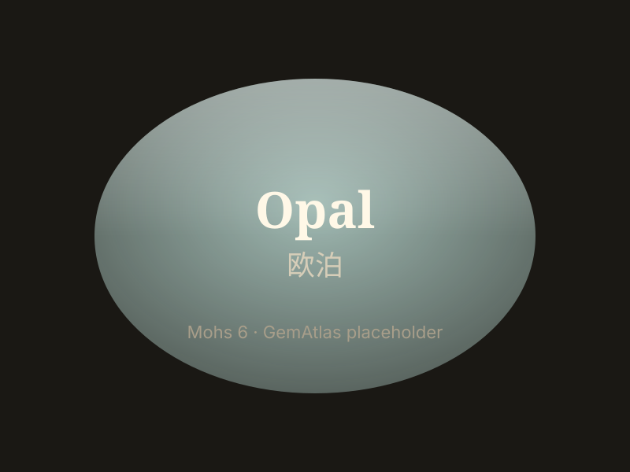

# 欧泊

> 蛋白石

<!-- language switcher hint -->
English: [Opal](/gems/opal)

---

## 分类

| 属性 | 值 |
|---|---|
| 矿物族 | 蛋白石 |
| 化学式 | SiO₂·nH₂O |
| 晶系 | amorphous |

## 物理性质

| 属性 | 值 |
|---|---|
| 莫氏硬度 | 5.5（含水，避免高温与脱水） |
| 比重 | 2.1 |
| 折射率 | 1.370-1.470 |

## 光学性质

| 属性 | 值 |
|---|---|
| 多色性 | — |
| 典型颜色 | 黑欧泊, 白欧泊, 火欧泊 |
| 致色原因 | 二氧化硅球粒衍射光栅产生变彩 |

## 处理与披露

| 处理方式 | 详情 |
|---------|------|
| 常见方法 | sugar-acid-treatment |
| 需披露 | 是 |
| 备注 | 糖酸处理用于仿黑欧泊，需披露 |

## 图库

