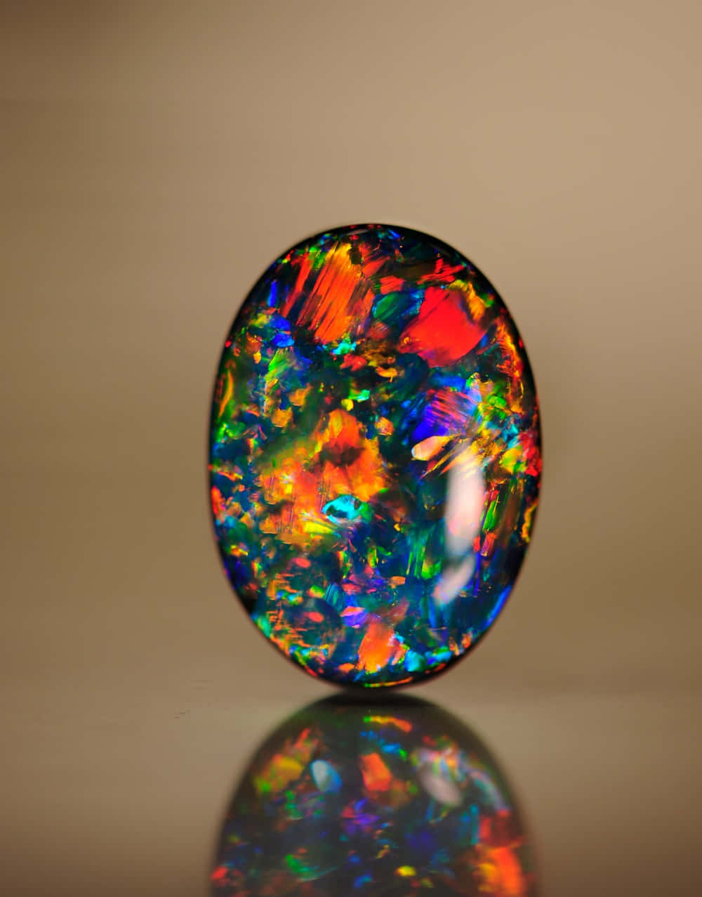
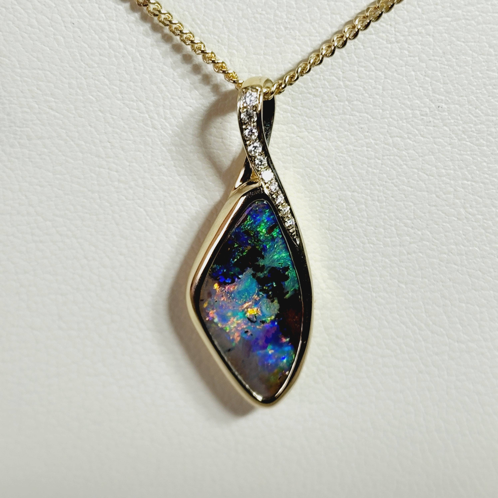
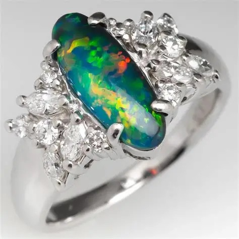

<a href="./">宝石名录</a>/欧泊

  

    
GEM ATLAS / 32

    <h1 id="gem-detail-title-opal">欧泊Opal</h1>
    
矿物身份蛋白石

    <dl class="gem-detail__identity-facts">
      
<dt>化学式</dt><dd>SiO₂·nH₂O</dd>

      
<dt>晶系</dt><dd>非晶质</dd>

    </dl>
    <dl class="gem-detail__quick-facts">
      
<dt>硬度</dt><dd>5.5</dd>

      
<dt>比重</dt><dd>2.1</dd>

      
<dt>折射率</dt><dd>1.370-1.470</dd>

    </dl>
    <a class="gem-detail__language" href="../../gems/opal.html" hreflang="en">English: Opal ↗</a>
  

  <figure class="gem-detail__hero-media"><figcaption>主视图视觉识别</figcaption></figure>

## 分类

身份 / 宝石档案

<table class="gem-detail__table">
  <thead><tr><th scope="col">属性</th><th scope="col">值</th></tr></thead>
  <tbody><tr><th scope="row">矿物族</th><td>蛋白石</td></tr><tr><th scope="row">化学式</th><td>SiO₂·nH₂O</td></tr><tr><th scope="row">晶系</th><td>非晶质</td></tr></tbody>
</table>

## 物理性质

<table class="gem-detail__table">
  <thead><tr><th scope="col">属性</th><th scope="col">值</th></tr></thead>
  <tbody><tr><th scope="row">莫氏硬度</th><td>5.5（含水，避免高温与脱水）</td></tr><tr><th scope="row">比重</th><td>2.1</td></tr><tr><th scope="row">折射率</th><td>1.370-1.470</td></tr></tbody>
</table>

## 光学性质

<table class="gem-detail__table">
  <thead><tr><th scope="col">属性</th><th scope="col">值</th></tr></thead>
  <tbody><tr><th scope="row">多色性</th><td>—</td></tr><tr><th scope="row">典型颜色</th><td>黑欧泊、白欧泊、火欧泊</td></tr><tr><th scope="row">致色原因</th><td>二氧化硅球粒衍射光栅产生变彩</td></tr></tbody>
</table>

## 处理与披露

  
常见处理<strong>糖酸处理</strong>

  
需要披露<strong class="is-required">是</strong>

  
说明糖酸处理用于仿黑欧泊，需披露

## 产地记录

代表性产地<ul><li>澳大利亚（南澳）</li><li>埃塞俄比亚</li><li>墨西哥</li></ul>

## 历史与传说

澳大利亚供应全球约95%的珍贵欧泊。火欧泊与黑欧泊（闪电岭）尤为珍贵，古罗马视欧泊为最珍贵宝石。 

## 图像证据

<figure><figcaption>证据 01</figcaption></figure>
<figure><figcaption>证据 02</figcaption></figure>
<figure><figcaption>证据 03</figcaption></figure>

继续阅读<i aria-hidden="true">/</i><small>CONTINUE EXPLORING</small>

<nav class="gem-detail__pager" aria-label="宝石记录导航">
<a class="gem-detail__pager-link gem-detail__pager-link--previous" href="./obsidian.html" aria-label="上一颗 黑曜石"><i aria-hidden="true">←</i>上一颗<strong>黑曜石</strong><small>Obsidian</small></a>
<a class="gem-detail__pager-index" href="./" aria-label="返回宝石名录">返回名录<strong>32 / 60</strong><small>全部宝石</small></a>
<a class="gem-detail__pager-link gem-detail__pager-link--next" href="./paraiba-tourmaline.html" aria-label="下一颗 帕拉伊巴碧玺">下一颗<strong>帕拉伊巴碧玺</strong><small>Paraíba Tourmaline</small><i aria-hidden="true">→</i></a>
</nav>

