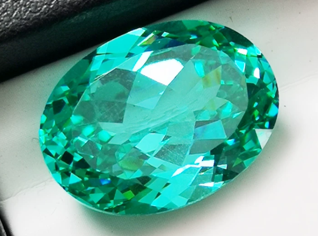

<a href="./">宝石名录</a>/帕拉伊巴碧玺

  

    
GEM ATLAS / 33

    <h1 id="gem-detail-title-paraiba-tourmaline">帕拉伊巴碧玺Paraíba Tourmaline</h1>
    
矿物身份电气石族

    <dl class="gem-detail__identity-facts">
      
<dt>化学式</dt><dd>Na(Li,Al)₃Al₆(BO₃)₃Si₆O₁₈(OH)₃</dd>

      
<dt>晶系</dt><dd>三方晶系</dd>

    </dl>
    <dl class="gem-detail__quick-facts">
      
<dt>硬度</dt><dd>7.5</dd>

      
<dt>比重</dt><dd>3.06</dd>

      
<dt>折射率</dt><dd>1.614-1.666</dd>

    </dl>
    <a class="gem-detail__language" href="../../gems/paraiba-tourmaline.html" hreflang="en">English: Paraíba Tourmaline ↗</a>
  

  <figure class="gem-detail__hero-media"><figcaption>主视图视觉识别</figcaption></figure>

## 分类

身份 / 宝石档案

<table class="gem-detail__table">
  <thead><tr><th scope="col">属性</th><th scope="col">值</th></tr></thead>
  <tbody><tr><th scope="row">矿物族</th><td>电气石族</td></tr><tr><th scope="row">化学式</th><td>Na(Li,Al)₃Al₆(BO₃)₃Si₆O₁₈(OH)₃</td></tr><tr><th scope="row">晶系</th><td>三方晶系</td></tr></tbody>
</table>

## 物理性质

<table class="gem-detail__table">
  <thead><tr><th scope="col">属性</th><th scope="col">值</th></tr></thead>
  <tbody><tr><th scope="row">莫氏硬度</th><td>7.5</td></tr><tr><th scope="row">比重</th><td>3.06</td></tr><tr><th scope="row">折射率</th><td>1.614-1.666</td></tr></tbody>
</table>

## 光学性质

<table class="gem-detail__table">
  <thead><tr><th scope="col">属性</th><th scope="col">值</th></tr></thead>
  <tbody><tr><th scope="row">多色性</th><td>强</td></tr><tr><th scope="row">典型颜色</th><td>电光蓝、蓝绿、紫罗兰</td></tr><tr><th scope="row">致色原因</th><td>Cu²⁺ 离子致霓虹色（核心产地溢价根源）</td></tr></tbody>
</table>

## 处理与披露

  
常见处理<strong>热处理</strong>

  
需要披露<strong class="is-required">是</strong>

  
说明巴西 Paraiba 州原产稀缺，莫桑比克产替代但溢价低

## 主要产地

记录产地<ul><li>巴西帕拉伊巴州</li><li>尼日利亚</li><li>莫桑比克</li></ul>

## 历史与传说

1989年在巴西帕拉伊巴州发现，电光蓝/霓虹绿由铜元素致色，一经问世即震撼业界，成为最贵碧玺。 

## 图像证据

<figure><figcaption>证据 01</figcaption></figure>
<figure><figcaption>证据 02</figcaption></figure>

继续阅读<i aria-hidden="true">/</i><small>CONTINUE EXPLORING</small>

<nav class="gem-detail__pager" aria-label="宝石记录导航">
<a class="gem-detail__pager-link gem-detail__pager-link--previous" href="./opal.html" aria-label="上一颗 欧泊"><i aria-hidden="true">←</i>上一颗<strong>欧泊</strong><small>Opal</small></a>
<a class="gem-detail__pager-index" href="./" aria-label="返回宝石名录">返回名录<strong>33 / 60</strong><small>全部宝石</small></a>
<a class="gem-detail__pager-link gem-detail__pager-link--next" href="./pearl.html" aria-label="下一颗 珍珠">下一颗<strong>珍珠</strong><small>Pearl</small><i aria-hidden="true">→</i></a>
</nav>

