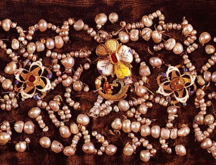
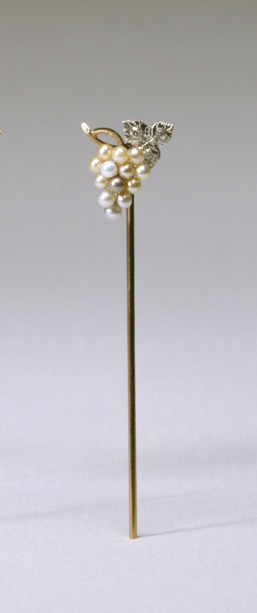
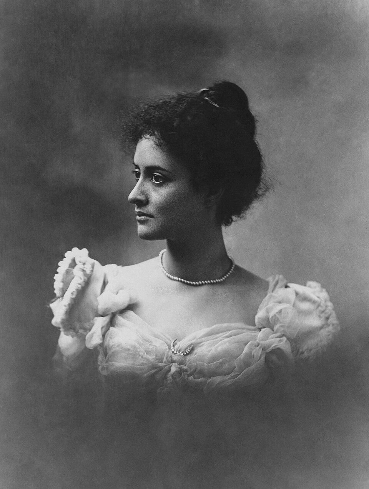
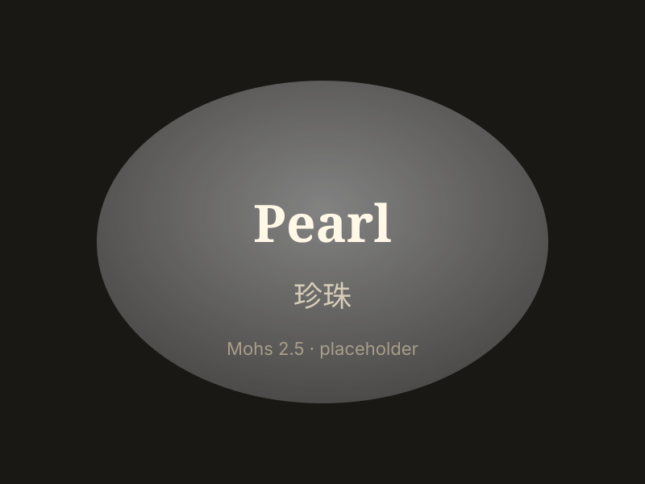

# 珍珠

> 有机宝石（碳酸钙）

<!-- language switcher hint -->
English: [Pearl](/gems/pearl)

---

## 分类

| 属性 | 值 |
|---|---|
| 矿物族 | 有机宝石（碳酸钙） |
| 化学式 | CaCO₃ (aragonite + conchiolin) |
| 晶系 | amorphous |

## 物理性质

| 属性 | 值 |
|---|---|
| 莫氏硬度 | 2.5（软——需佩戴呵护） |
| 比重 | 2.7 |
| 折射率 | 1.52-1.69 |

## 光学性质

| 属性 | 值 |
|---|---|
| 多色性 | none |
| 典型颜色 | 白色, 奶油色, 金色, 黑色（大溪地） |
| 致色原因 | 珍珠层 (nacre) 的干涉与散射 |

## 处理与披露

| 处理方式 | 详情 |
|---------|------|
| 常见方法 | bleaching, dyeing |
| 需披露 | 是 |
| 备注 | 天然 vs 养殖需 X 光或专业检测；仿品为玻璃/塑料珠 |

## 主要产地

| 产地 |
|---|
| 波斯湾 |
| 大溪地 |
| 日本 |
| 澳大利亚 |

## 历史与传说

珍珠是唯一由生物体产生的宝石，数千年来象征纯洁。波斯湾天然珍珠与日本御木本养殖珍珠开创现代产业。

## 图库

