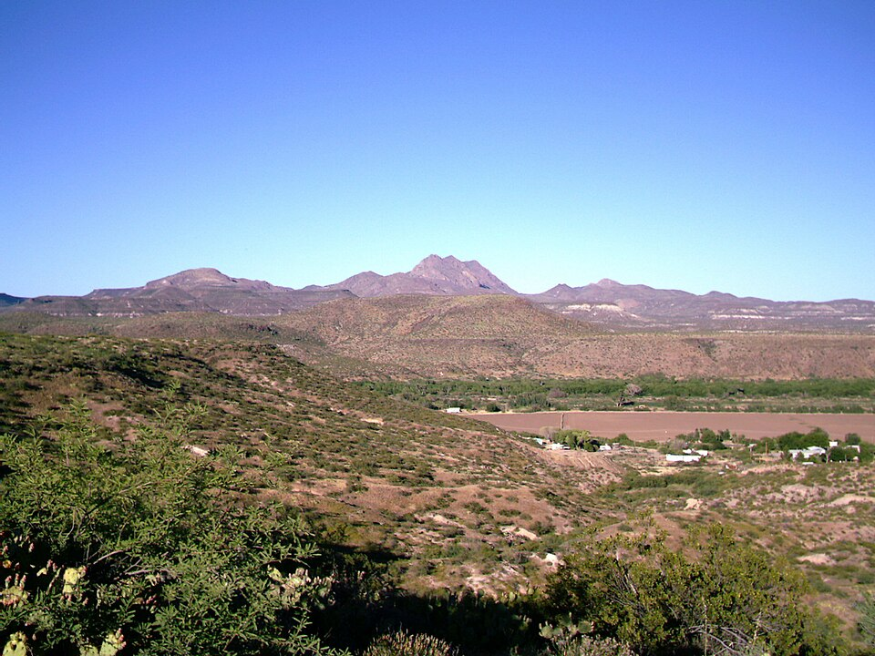
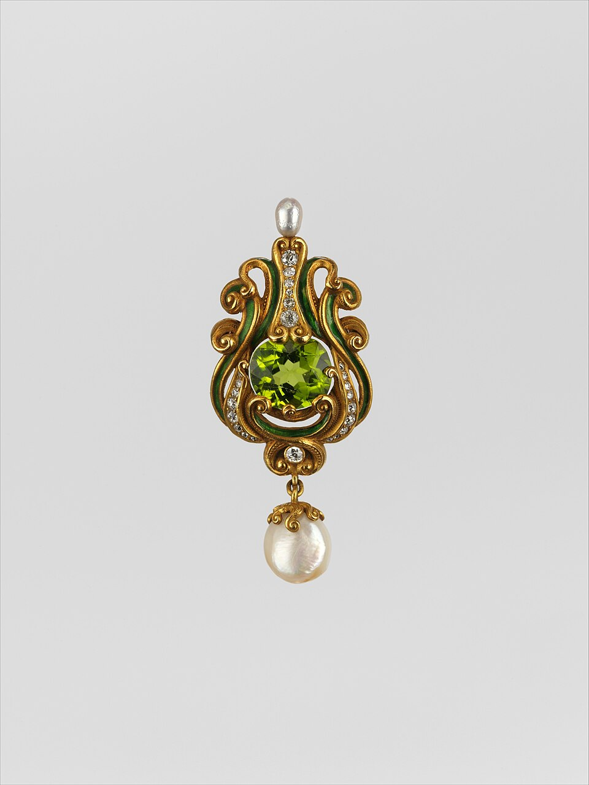
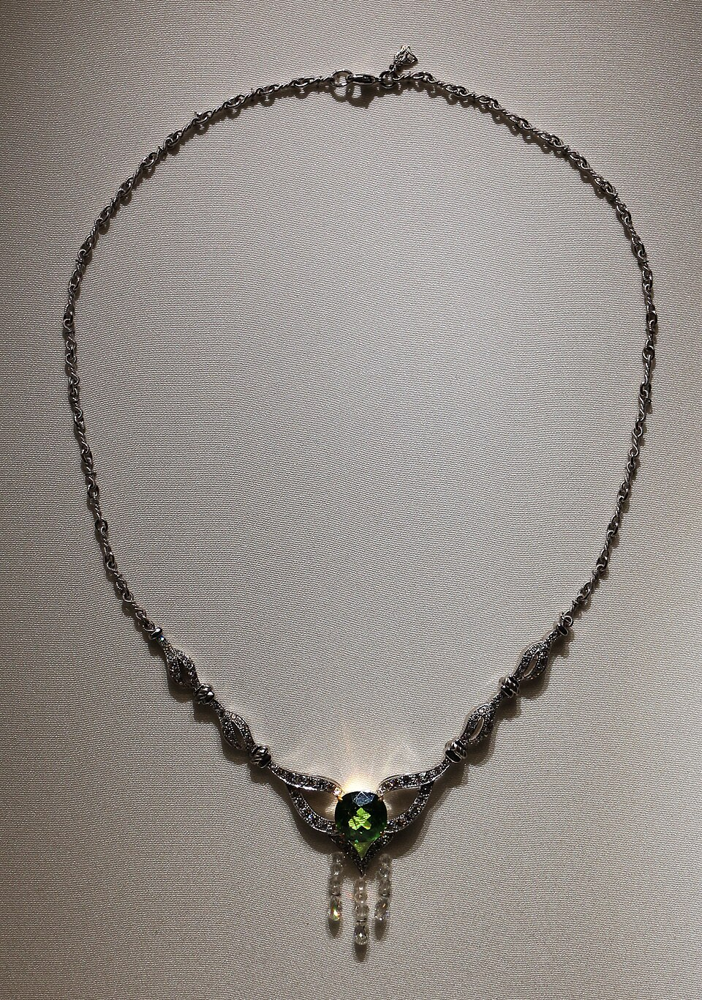
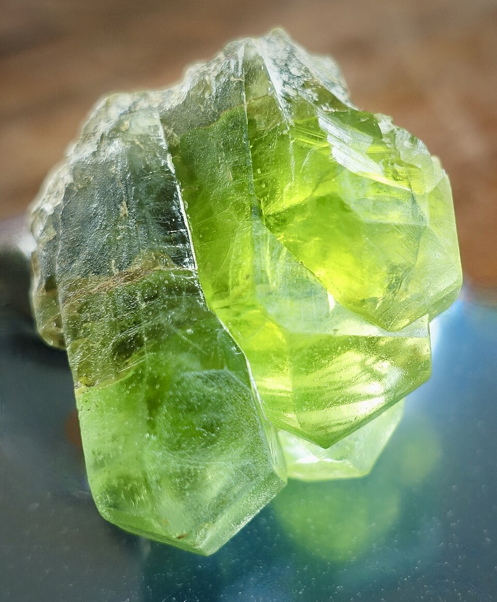

# 橄榄石

> 橄榄石族

<!-- language switcher hint -->
English: [Peridot](/gems/peridot)

---

## 分类

| 属性 | 值 |
|---|---|
| 矿物族 | 橄榄石族 |
| 化学式 | (Mg,Fe)₂SiO₄ |
| 晶系 | orthorhombic |

## 物理性质

| 属性 | 值 |
|---|---|
| 莫氏硬度 | 6.75 |
| 比重 | 3.28 |
| 折射率 | 1.635-1.690 |

## 光学性质

| 属性 | 值 |
|---|---|
| 多色性 | weak |
| 典型颜色 | 橄榄绿, 黄绿色, 褐绿色 |
| 致色原因 | Fe²⁺ 致黄绿至橄榄绿 |

## 处理与披露

| 处理方式 | 详情 |
|---------|------|
| 常见方法 | 无 / 通常无处理 |
| 需披露 | 否 |
| 备注 | 橄榄石通常无处理；稀有陨石来源橄榄石价值更高 |

## 主要产地

| 产地 |
|---|
| 埃及圣约翰岛 |
| 中国 |
| 巴基斯坦 |
| 美国亚利桑那 |

## 历史与传说

橄榄石是最古老宝石之一，古埃及称为"太阳之石"。中国与巴基斯坦现为主要供应地。

## 图库

