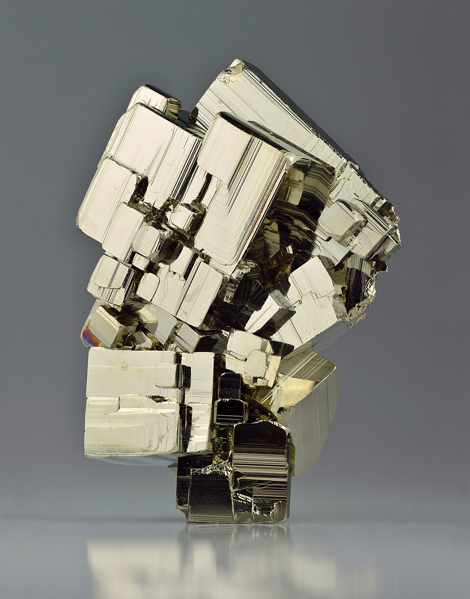
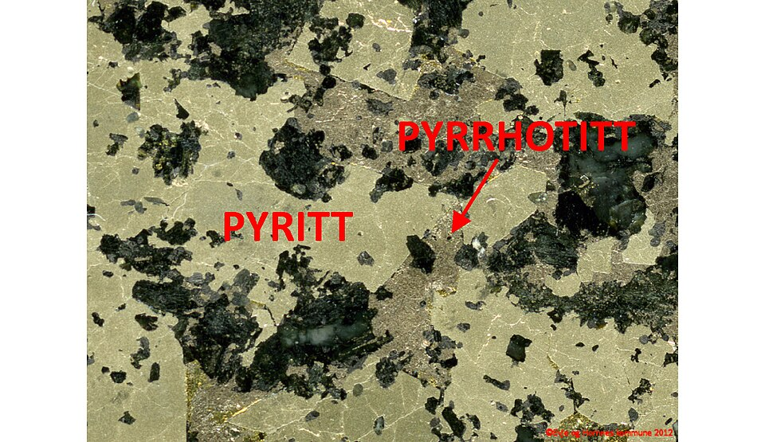
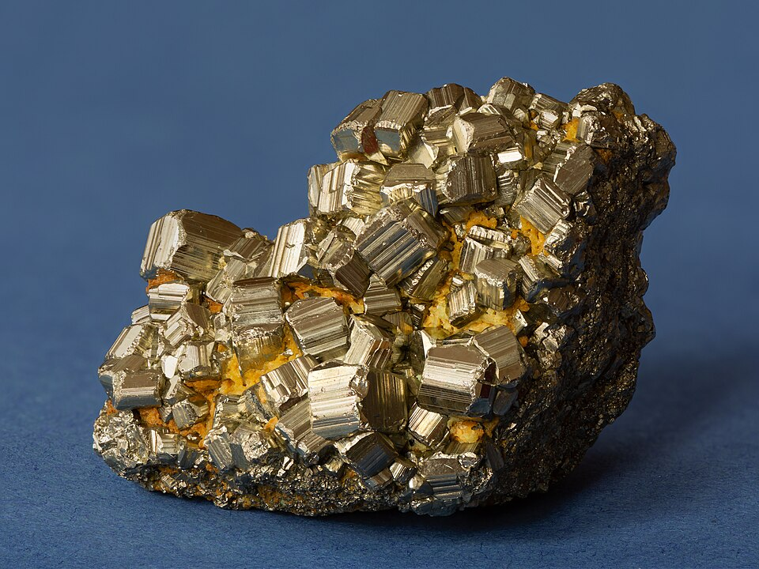

# 黄铁矿

> 硫化物

<!-- language switcher hint -->
English: [Pyrite](/gems/pyrite)

---

## 分类

| 属性 | 值 |
|---|---|
| 矿物族 | 硫化物 |
| 化学式 | FeS₂ |
| 晶系 | cubic |

## 物理性质

| 属性 | 值 |
|---|---|
| 莫氏硬度 | 6.5 |
| 比重 | 5.01 |
| 折射率 | 1.810-2.024 |

## 光学性质

| 属性 | 值 |
|---|---|
| 多色性 | none |
| 典型颜色 | 黄铜色至金棕色 |
| 致色原因 | Fe-S 电荷转移致金黄色金属光泽 |

## 处理与披露

| 处理方式 | 详情 |
|---------|------|
| 常见方法 | surface-coating |
| 需披露 | 是 |
| 备注 | 别名"愚人金"，易与真金混淆；常作为装饰材料 |

## 图库

