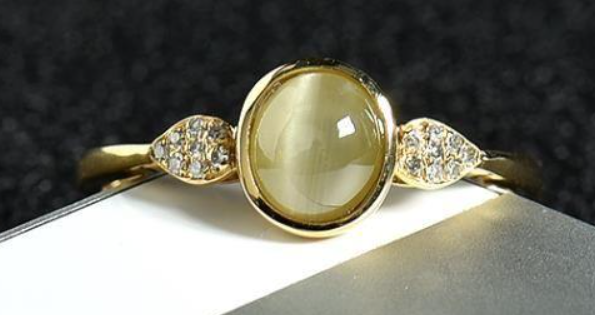
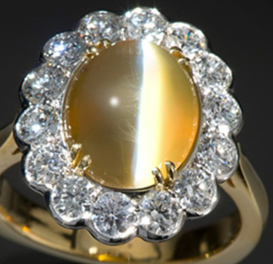

# 石英猫眼

> 石英族

<!-- language switcher hint -->
English: [Quartz Cat's-eye](/gems/quartz-catseye)

---

## 分类

| 属性 | 值 |
|---|---|
| 矿物族 | 石英族 |
| 化学式 | SiO2 + crocidolite fibers |
| 晶系 | trigonal |

## 物理性质

| 属性 | 值 |
|---|---|
| 莫氏硬度 | 7 |
| 比重 | 2.65 |
| 折射率 | 1.544-1.553 |

## 光学性质

| 属性 | 值 |
|---|---|
| 多色性 | none |
| 典型颜色 | 黄绿色带猫眼, 灰绿色, 棕色 |
| 致色原因 | 石棉纤维包裹体产生猫眼效应 |

## 处理与披露

| 处理方式 | 详情 |
|---------|------|
| 常见方法 | heat-treatment |
| 需披露 | 是 |
| 备注 | 与金绿猫眼不同，石英猫眼的猫眼带较宽、效果较弱 |

## 主要产地

| 产地 |
|---|
| 斯里兰卡 |
| 印度 |
| 巴西 |

## 历史与传说

石英猫眼含平行针状包体产生猫眼效应，比金绿猫眼便宜但同样迷人。

## 图库

