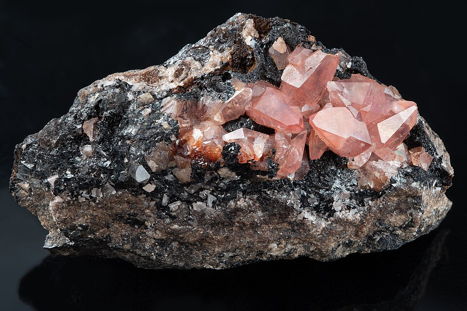
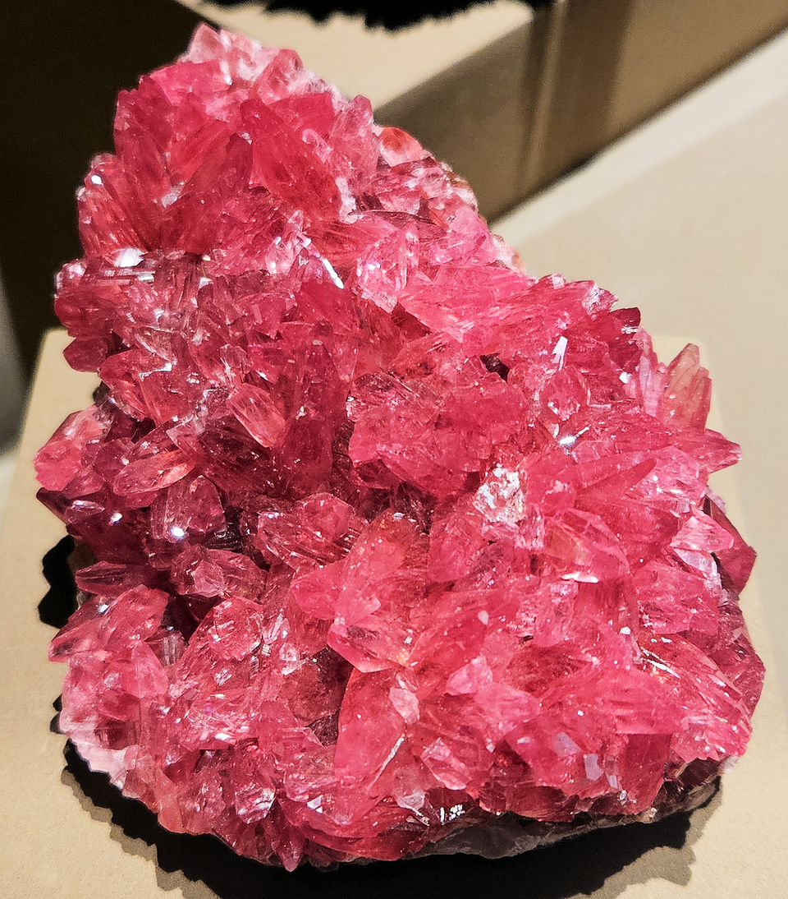
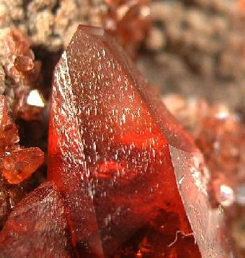
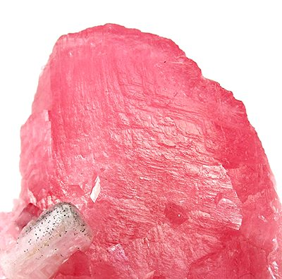

# 菱锰矿

> 碳酸盐

<!-- language switcher hint -->
English: [Rhodochrosite](/gems/rhodochrosite)

---

## 分类

| 属性 | 值 |
|---|---|
| 矿物族 | 碳酸盐 |
| 化学式 | MnCO₃ |
| 晶系 | trigonal |

## 物理性质

| 属性 | 值 |
|---|---|
| 莫氏硬度 | 4 |
| 比重 | 3.7 |
| 折射率 | 1.600-1.820 |

## 光学性质

| 属性 | 值 |
|---|---|
| 多色性 | weak |
| 典型颜色 | 玫瑰红, 粉红色, 红白条带 |
| 致色原因 | Mn²⁺ 致玫瑰红色 |

## 处理与披露

| 处理方式 | 详情 |
|---------|------|
| 常见方法 | wax-impregnation |
| 需披露 | 是 |
| 备注 | 阿根廷"印加玫瑰"为最著名品种，具同心圆条带 |

## 主要产地

| 产地 |
|---|
| 阿根廷卡皮利亚 |
| 南非 |
| 美国科罗拉多 |

## 历史与传说

菱锰矿"印加玫瑰"是阿根廷国石，带状粉色纹理似玫瑰花瓣。

## 图库

