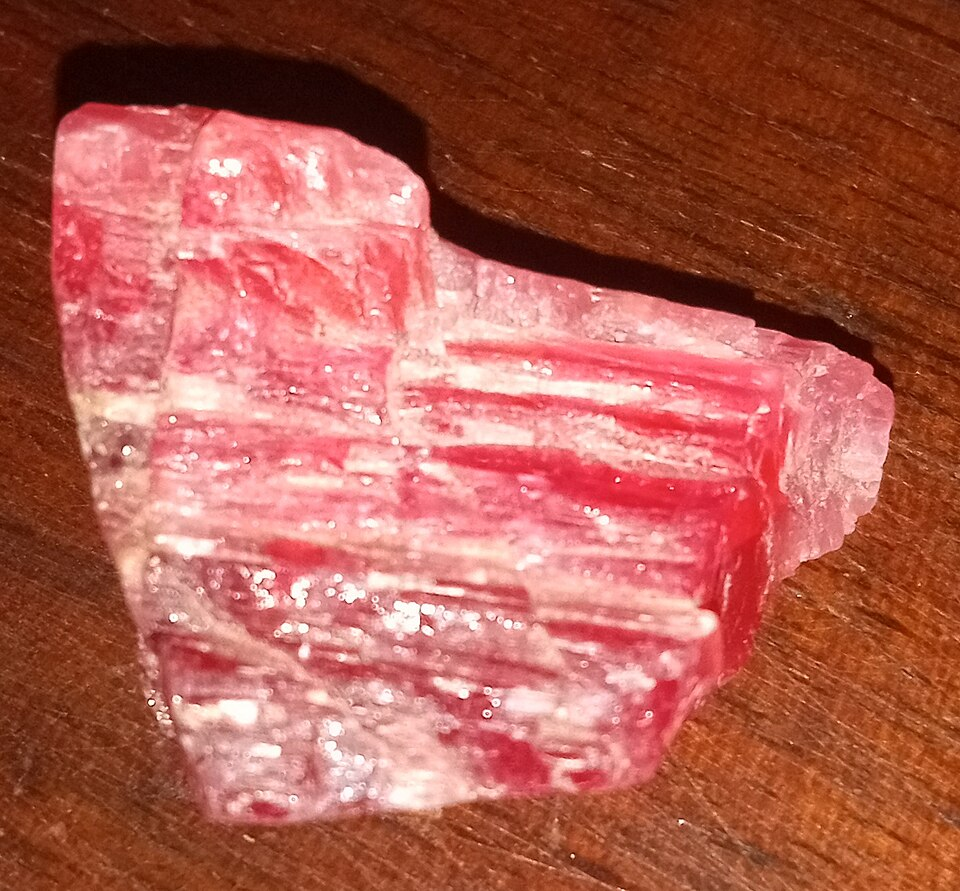
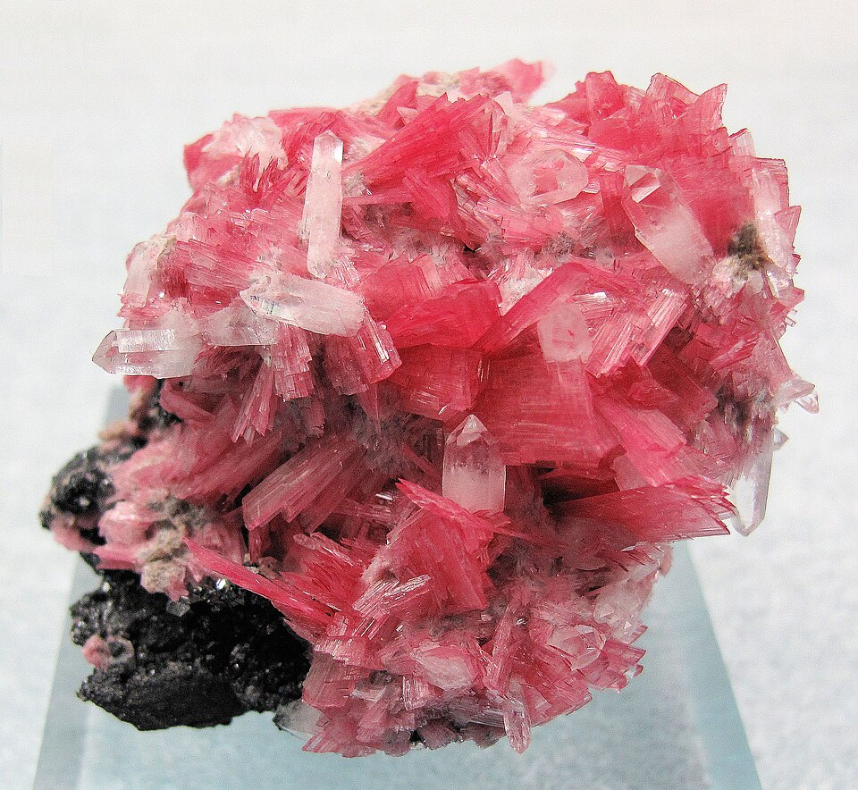
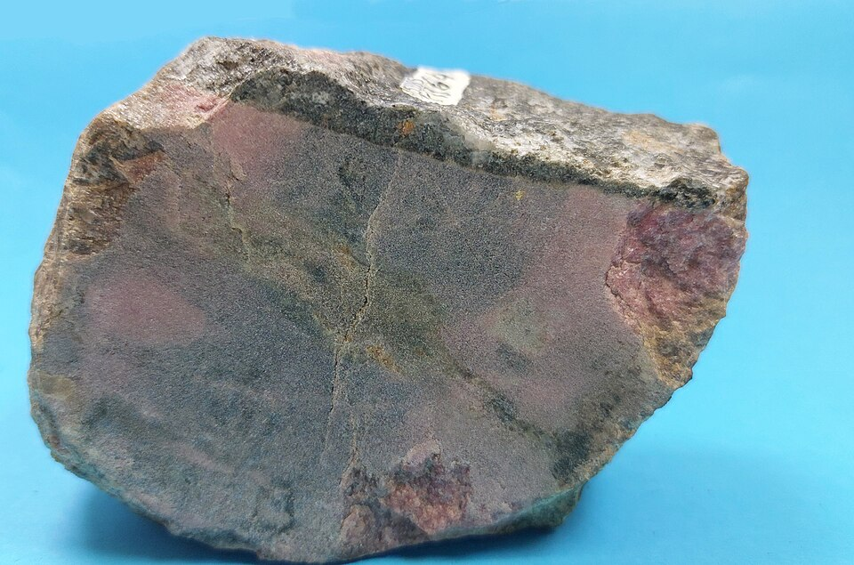

# 蔷薇辉石

> 辉石族（紫苏辉石型）

<!-- language switcher hint -->
English: [Rhodonite](/gems/rhodonite)

---

## 分类

| 属性 | 值 |
|---|---|
| 矿物族 | 辉石族（紫苏辉石型） |
| 化学式 | MnSiO₃ |
| 晶系 | triclinic |

## 物理性质

| 属性 | 值 |
|---|---|
| 莫氏硬度 | 6.25 |
| 比重 | 3.68 |
| 折射率 | 1.716-1.752 |

## 光学性质

| 属性 | 值 |
|---|---|
| 多色性 | weak |
| 典型颜色 | 玫瑰红色，带黑色氧化锰纹, 粉红色, 红褐色 |
| 致色原因 | Mn²⁺ 致粉红至玫瑰红 |

## 处理与披露

| 处理方式 | 详情 |
|---------|------|
| 常见方法 | wax-impregnation |
| 需披露 | 是 |
| 备注 | 俄罗斯"苏联石"（Rhodonite）是最著名产地品种 |

## 主要产地

| 产地 |
|---|
| 俄罗斯乌拉尔 |
| 瑞典 |
| 澳大利亚 |
| 美国马萨诸塞 |

## 历史与传说

蔷薇辉石粉色含黑色锰氧化物网纹，俄罗斯以之制巨型装饰，马萨诸塞州石。

## 图库

