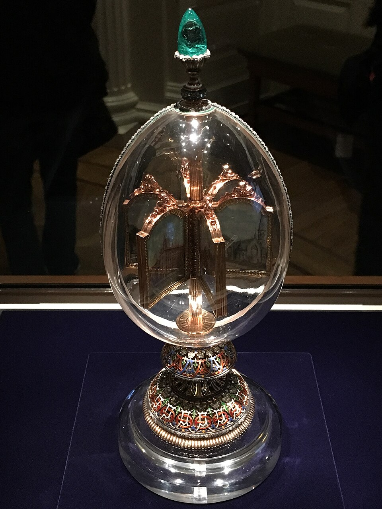

# 水晶

> 石英族

<!-- language switcher hint -->
English: [Rock Crystal](/gems/rock-crystal)

---

## 分类

| 属性 | 值 |
|---|---|
| 矿物族 | 石英族 |
| 化学式 | SiO₂ |
| 晶系 | trigonal |

## 物理性质

| 属性 | 值 |
|---|---|
| 莫氏硬度 | 7 |
| 比重 | 2.65 |
| 折射率 | 1.544-1.553 |

## 光学性质

| 属性 | 值 |
|---|---|
| 多色性 | none |
| 典型颜色 | 无色透明 |
| 致色原因 | 无致色元素 |

## 处理与披露

| 处理方式 | 详情 |
|---------|------|
| 常见方法 | heat-treatment, irradiation |
| 需披露 | 否 |
| 备注 | 最常见天然宝石原料，全球广泛分布；含发晶、水胆水晶等变种 |

## 图库

