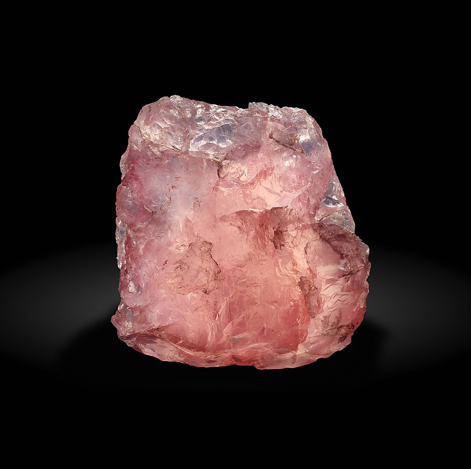
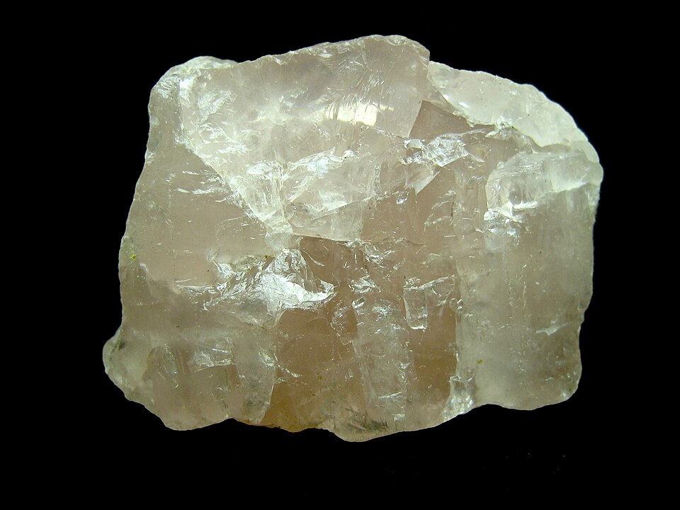

# 粉晶

> 石英族

<!-- language switcher hint -->
English: [Rose Quartz](/gems/rose-quartz)

---

## 分类

| 属性 | 值 |
|---|---|
| 矿物族 | 石英族 |
| 化学式 | SiO₂ |
| 晶系 | trigonal |

## 物理性质

| 属性 | 值 |
|---|---|
| 莫氏硬度 | 7 |
| 比重 | 2.65 |
| 折射率 | 1.544-1.553 |

## 光学性质

| 属性 | 值 |
|---|---|
| 多色性 | weak |
| 典型颜色 | 粉红色, 桃粉色, 紫粉色 |
| 致色原因 | Ti³⁺ 或 Al + P 色心致粉红 |

## 处理与披露

| 处理方式 | 详情 |
|---------|------|
| 常见方法 | 无 / 通常无处理 |
| 需披露 | 否 |
| 备注 | 通常无处理；大量用于雕刻与首饰；少有完好晶形 |

## 图库

