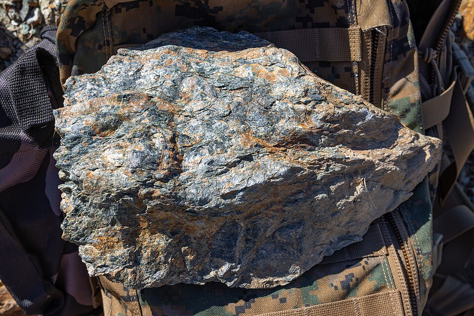
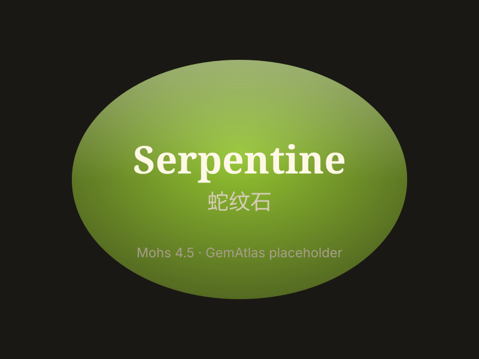

# 蛇纹石

> 蛇纹石族

<!-- language switcher hint -->
English: [Serpentine](/gems/serpentine)

---

## 分类

| 属性 | 值 |
|---|---|
| 矿物族 | 蛇纹石族 |
| 化学式 | Mg₃Si₂O₅(OH)₄ |
| 晶系 | monoclinic |

## 物理性质

| 属性 | 值 |
|---|---|
| 莫氏硬度 | 4.5 |
| 比重 | 2.55 |
| 折射率 | 1.560-1.590 |

## 光学性质

| 属性 | 值 |
|---|---|
| 多色性 | none |
| 典型颜色 | 黄绿色, 深绿色（岫玉）, 蓝绿色, 白色带纹理 |
| 致色原因 | Fe²⁺ 致绿；含铁量变化产生不同色调 |

## 处理与披露

| 处理方式 | 详情 |
|---------|------|
| 常见方法 | wax-impregnation, dyeing |
| 需披露 | 是 |
| 备注 | 中国岫玉（蛇纹石玉）有数千年开采史；与和田玉不同矿物 |

## 图库

