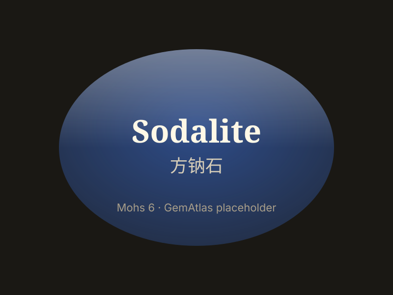

# 方钠石

> 方钠石族

<!-- language switcher hint -->
English: [Sodalite](/gems/sodalite)

---

## 分类

| 属性 | 值 |
|---|---|
| 矿物族 | 方钠石族 |
| 化学式 | Na₈(AlSiO₄)₆Cl₂ |
| 晶系 | cubic |

## 物理性质

| 属性 | 值 |
|---|---|
| 莫氏硬度 | 6 |
| 比重 | 2.28 |
| 折射率 | 1.483-1.490 |

## 光学性质

| 属性 | 值 |
|---|---|
| 多色性 | none |
| 典型颜色 | 深蓝色, 浅蓝色带白纹, 紫蓝色 |
| 致色原因 | S₃⁻ 色心致蓝色（与青金石同机制） |

## 处理与披露

| 处理方式 | 详情 |
|---------|------|
| 常见方法 | wax-impregnation, dyeing |
| 需披露 | 是 |
| 备注 | 常被误认为青金石；方钠石白纹更多、黄铁矿斑更少 |

## 图库

