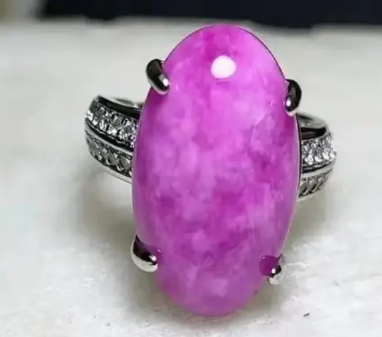

<a href="./">宝石名录</a>/苏纪石

  

    
GEM ATLAS / 52

    <h1 id="gem-detail-title-sugilite">苏纪石Sugilite</h1>
    
矿物身份硅酸盐

    <dl class="gem-detail__identity-facts">
      
<dt>化学式</dt><dd>KNa₂(Fe,Mn,Al)₂Li₃Si₁₂O₃₀</dd>

      
<dt>晶系</dt><dd>六方晶系</dd>

    </dl>
    <dl class="gem-detail__quick-facts">
      
<dt>硬度</dt><dd>6.5</dd>

      
<dt>比重</dt><dd>2.74</dd>

      
<dt>折射率</dt><dd>1.607-1.638</dd>

    </dl>
    <a class="gem-detail__language" href="../../gems/sugilite.html" hreflang="en">English: Sugilite ↗</a>
  

  <figure class="gem-detail__hero-media"><figcaption>主视图视觉识别</figcaption></figure>

## 分类

身份 / 宝石档案

<table class="gem-detail__table">
  <thead><tr><th scope="col">属性</th><th scope="col">值</th></tr></thead>
  <tbody><tr><th scope="row">矿物族</th><td>硅酸盐</td></tr><tr><th scope="row">化学式</th><td>KNa₂(Fe,Mn,Al)₂Li₃Si₁₂O₃₀</td></tr><tr><th scope="row">晶系</th><td>六方晶系</td></tr></tbody>
</table>

## 物理性质

<table class="gem-detail__table">
  <thead><tr><th scope="col">属性</th><th scope="col">值</th></tr></thead>
  <tbody><tr><th scope="row">莫氏硬度</th><td>6.5</td></tr><tr><th scope="row">比重</th><td>2.74</td></tr><tr><th scope="row">折射率</th><td>1.607-1.638</td></tr></tbody>
</table>

## 光学性质

<table class="gem-detail__table">
  <thead><tr><th scope="col">属性</th><th scope="col">值</th></tr></thead>
  <tbody><tr><th scope="row">多色性</th><td>弱</td></tr><tr><th scope="row">典型颜色</th><td>紫红色、紫罗兰、粉紫色</td></tr><tr><th scope="row">致色原因</th><td>Mn²⁺/Fe³⁺ 致紫红色</td></tr></tbody>
</table>

## 处理与披露

  
常见处理<strong>无 / 通常无处理</strong>

  
需要披露<strong class="">否</strong>

  
说明南非北开普省为最重要产地（1973 年发现）

## 主要产地

记录产地<ul><li>南非温贝</li><li>日本</li><li>加拿大</li></ul>

## 历史与传说

苏纪石1970年代在南非温贝矿首次大量发现，浓郁紫色被昵称&quot;爱情石&quot;。 

## 图像证据

<figure><figcaption>证据 01</figcaption></figure>
<figure><figcaption>证据 02</figcaption></figure>
<figure><figcaption>证据 03</figcaption></figure>

继续阅读<i aria-hidden="true">/</i><small>CONTINUE EXPLORING</small>

<nav class="gem-detail__pager" aria-label="宝石记录导航">
<a class="gem-detail__pager-link gem-detail__pager-link--previous" href="./spinel.html" aria-label="上一颗 尖晶石"><i aria-hidden="true">←</i>上一颗<strong>尖晶石</strong><small>Spinel</small></a>
<a class="gem-detail__pager-index" href="./" aria-label="返回宝石名录">返回名录<strong>52 / 60</strong><small>全部宝石</small></a>
<a class="gem-detail__pager-link gem-detail__pager-link--next" href="./sunstone.html" aria-label="下一颗 太阳石">下一颗<strong>太阳石</strong><small>Sunstone</small><i aria-hidden="true">→</i></a>
</nav>

