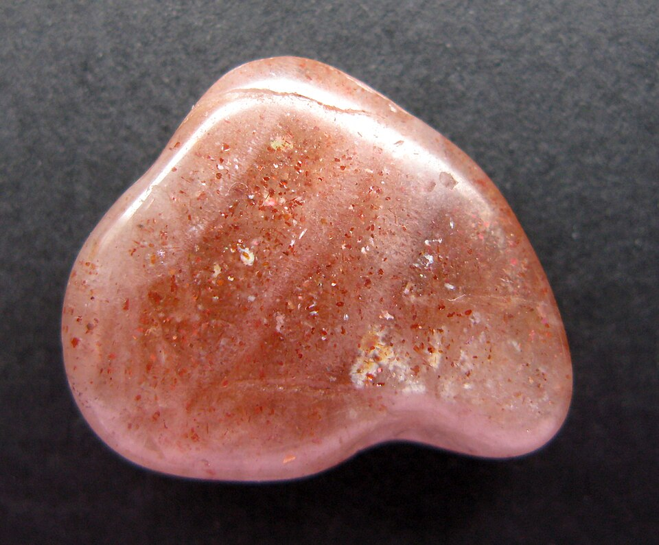
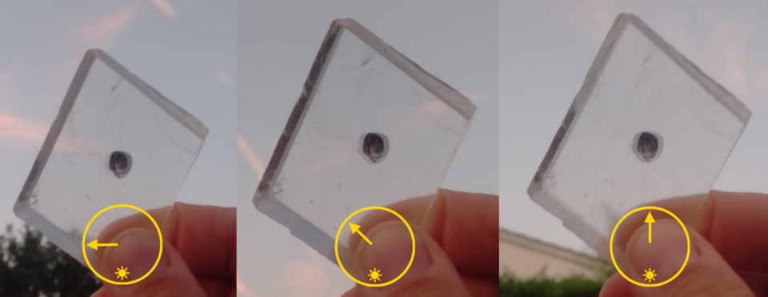
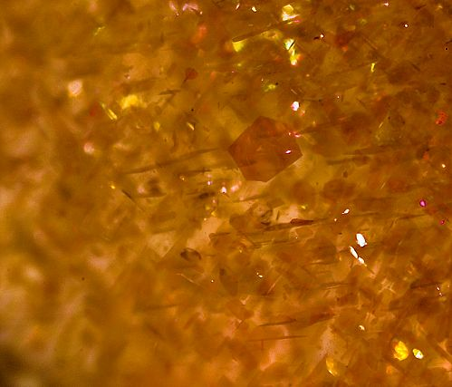

# 太阳石

> 长石族

<!-- language switcher hint -->
English: [Sunstone](/gems/sunstone)

---

## 分类

| 属性 | 值 |
|---|---|
| 矿物族 | 长石族 |
| 化学式 | (Na,Ca)(Si,Al)₄O₈ + Cu/Fe platelets |
| 晶系 | triclinic |

## 物理性质

| 属性 | 值 |
|---|---|
| 莫氏硬度 | 6.25 |
| 比重 | 2.64 |
| 折射率 | 1.537-1.547 |

## 光学性质

| 属性 | 值 |
|---|---|
| 多色性 | none |
| 典型颜色 | 橙红色带金色闪, 桃红色, 黄绿色 |
| 致色原因 | 含铜/赤铁矿薄片产生砂金效应（见光学现象-砂金效应） |

## 处理与披露

| 处理方式 | 详情 |
|---------|------|
| 常见方法 | 无 / 通常无处理 |
| 需披露 | 否 |
| 备注 | 美国俄勒冈太阳石以含天然铜片（无需优化）而闻名 |

## 图库

