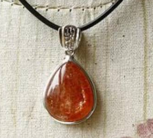

<a href="./">宝石名录</a>/太阳石

  

    
GEM ATLAS / 53

    <h1 id="gem-detail-title-sunstone">太阳石Sunstone</h1>
    
矿物身份长石族

    <dl class="gem-detail__identity-facts">
      
<dt>化学式</dt><dd>(Na,Ca)(Si,Al)₄O₈ + Cu/Fe platelets</dd>

      
<dt>晶系</dt><dd>三斜晶系</dd>

    </dl>
    <dl class="gem-detail__quick-facts">
      
<dt>硬度</dt><dd>6.25</dd>

      
<dt>比重</dt><dd>2.64</dd>

      
<dt>折射率</dt><dd>1.537-1.547</dd>

    </dl>
    <a class="gem-detail__language" href="../../gems/sunstone.html" hreflang="en">English: Sunstone ↗</a>
  

  <figure class="gem-detail__hero-media"><figcaption>主视图视觉识别</figcaption></figure>

## 分类

身份 / 宝石档案

<table class="gem-detail__table">
  <thead><tr><th scope="col">属性</th><th scope="col">值</th></tr></thead>
  <tbody><tr><th scope="row">矿物族</th><td>长石族</td></tr><tr><th scope="row">化学式</th><td>(Na,Ca)(Si,Al)₄O₈ + Cu/Fe platelets</td></tr><tr><th scope="row">晶系</th><td>三斜晶系</td></tr></tbody>
</table>

## 物理性质

<table class="gem-detail__table">
  <thead><tr><th scope="col">属性</th><th scope="col">值</th></tr></thead>
  <tbody><tr><th scope="row">莫氏硬度</th><td>6.25</td></tr><tr><th scope="row">比重</th><td>2.64</td></tr><tr><th scope="row">折射率</th><td>1.537-1.547</td></tr></tbody>
</table>

## 光学性质

<table class="gem-detail__table">
  <thead><tr><th scope="col">属性</th><th scope="col">值</th></tr></thead>
  <tbody><tr><th scope="row">多色性</th><td>无</td></tr><tr><th scope="row">典型颜色</th><td>橙红色带金色闪、桃红色、黄绿色</td></tr><tr><th scope="row">致色原因</th><td>含铜/赤铁矿薄片产生砂金效应（见光学现象-砂金效应）</td></tr></tbody>
</table>

## 处理与披露

  
常见处理<strong>无 / 通常无处理</strong>

  
需要披露<strong class="">否</strong>

  
说明美国俄勒冈太阳石以含天然铜片（无需优化）而闻名

## 产地记录

代表性产地<ul><li>美国俄勒冈</li><li>印度</li><li>挪威</li></ul>

## 历史与传说

太阳石含赤铁矿/铜片产生金黄闪光（aventurescence），俄勒冈铜太阳石尤为著名。 

## 图像证据

<figure><figcaption>证据 01</figcaption></figure>

继续阅读<i aria-hidden="true">/</i><small>CONTINUE EXPLORING</small>

<nav class="gem-detail__pager" aria-label="宝石记录导航">
<a class="gem-detail__pager-link gem-detail__pager-link--previous" href="./sugilite.html" aria-label="上一颗 苏纪石"><i aria-hidden="true">←</i>上一颗<strong>苏纪石</strong><small>Sugilite</small></a>
<a class="gem-detail__pager-index" href="./" aria-label="返回宝石名录">返回名录<strong>53 / 60</strong><small>全部宝石</small></a>
<a class="gem-detail__pager-link gem-detail__pager-link--next" href="./tanzanite.html" aria-label="下一颗 坦桑石">下一颗<strong>坦桑石</strong><small>Tanzanite</small><i aria-hidden="true">→</i></a>
</nav>

