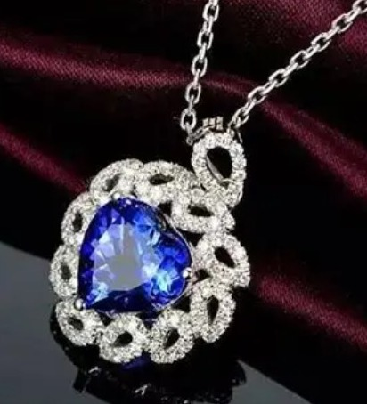
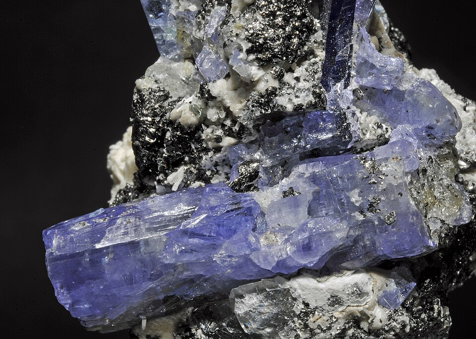
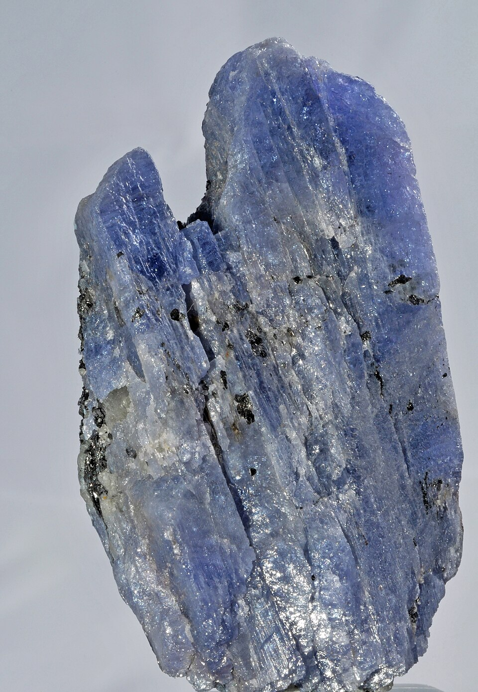
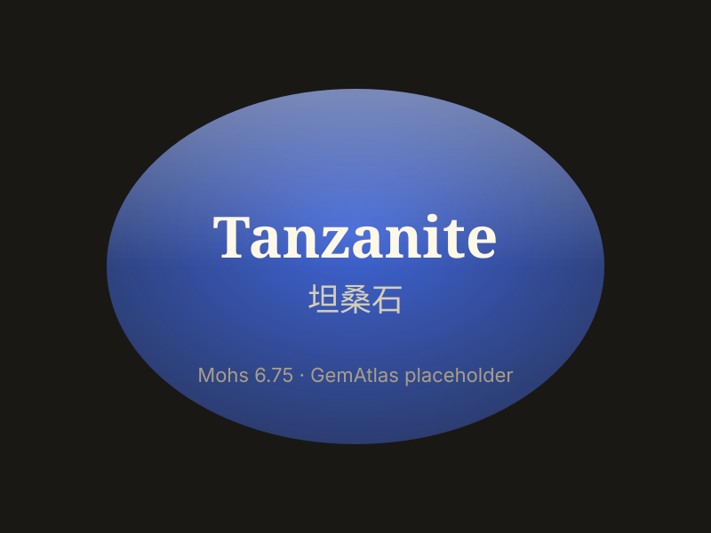

# 坦桑石

> 黝帘石族

<!-- language switcher hint -->
English: [Tanzanite](/gems/tanzanite)

---

## 分类

| 属性 | 值 |
|---|---|
| 矿物族 | 黝帘石族 |
| 化学式 | Ca₂Al₃(SiO₄)₃(OH) |
| 晶系 | orthorhombic |

## 物理性质

| 属性 | 值 |
|---|---|
| 莫氏硬度 | 6.5（性较脆，注意避免撞击） |
| 比重 | 3.35 |
| 折射率 | 1.691-1.700 |

## 光学性质

| 属性 | 值 |
|---|---|
| 多色性 | strong |
| 典型颜色 | 蓝紫, 紫罗兰 |
| 致色原因 | V³⁺ 离子致色 |

## 处理与披露

| 处理方式 | 详情 |
|---------|------|
| 常见方法 | heat-treatment |
| 需披露 | 是 |
| 备注 | 几乎所有坦桑石均经热处理以增强蓝紫调 |

## 图库

