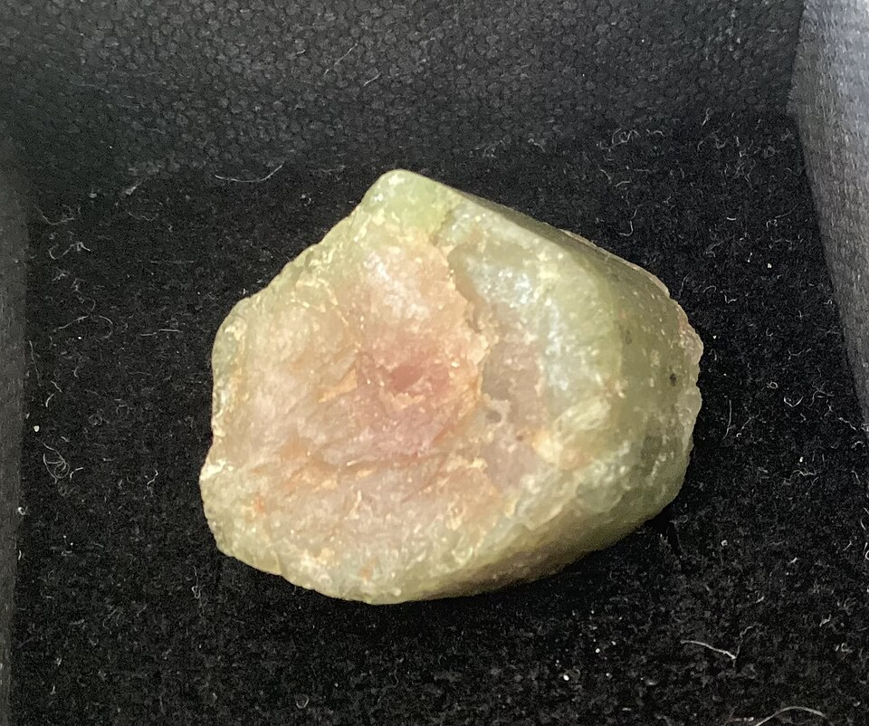
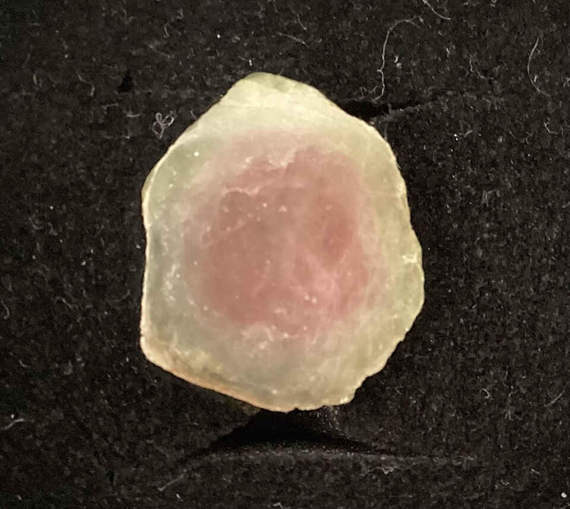
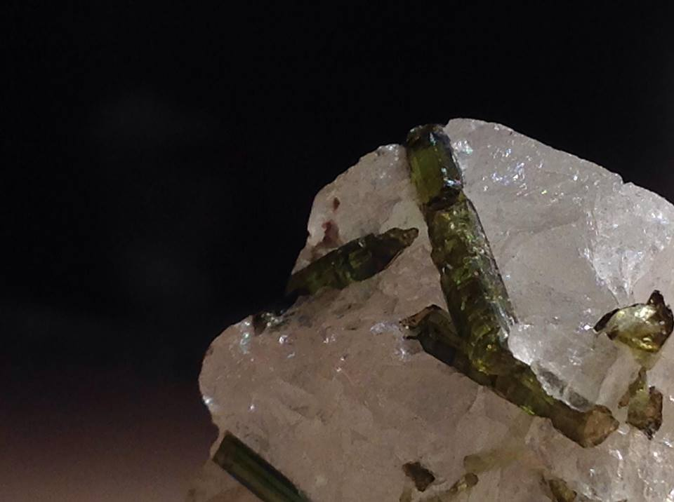
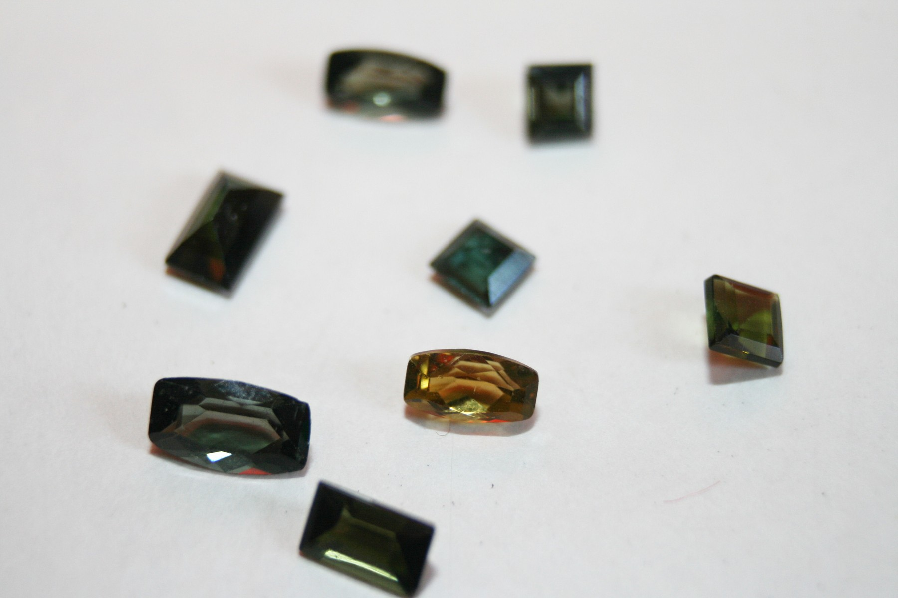

# 碧玺

> 电气石族

<!-- language switcher hint -->
English: [Tourmaline](/gems/tourmaline)

---

## 分类

| 属性 | 值 |
|---|---|
| 矿物族 | 电气石族 |
| 化学式 | Na(Li,Al)₃Al₆(BO₃)₃Si₆O₁₈(OH)₃ |
| 晶系 | trigonal |

## 物理性质

| 属性 | 值 |
|---|---|
| 莫氏硬度 | 7.25 |
| 比重 | 3.06 |
| 折射率 | 1.614-1.666 |

## 光学性质

| 属性 | 值 |
|---|---|
| 多色性 | strong |
| 典型颜色 | 粉红, 绿色, 蓝色, 双色（西瓜碧玺）, 黑色 |
| 致色原因 | Fe/Mn/Ti/Cu 等过渡金属多色致色 |

## 处理与披露

| 处理方式 | 详情 |
|---------|------|
| 常见方法 | heat-treatment, irradiation |
| 需披露 | 是 |
| 备注 | 加热可改善颜色；辐照可加深浅色品种 |

## 主要产地

| 产地 |
|---|
| 巴西 |
| 阿富汗 |
| 莫桑比克 |
| 美国缅因/加州 |

## 历史与传说

碧玺颜色之多居宝石之首，"西瓜碧玺"双色共生尤为珍奇。古锡兰语意为"彩色宝石"。

## 图库

