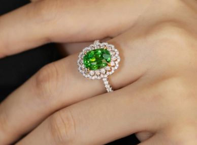
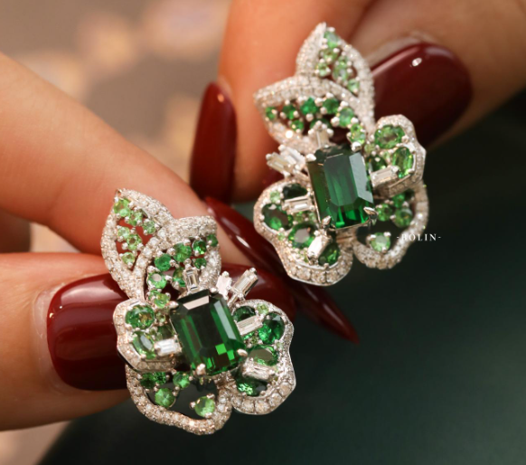

# 沙弗莱石榴石

> 石榴石族

<!-- language switcher hint -->
English: [Tsavorite Garnet](/gems/tsavorite-garnet)

---

## 分类

| 属性 | 值 |
|---|---|
| 矿物族 | 石榴石族 |
| 化学式 | Ca₃Al₂(SiO₄)₃ |
| 晶系 | cubic |

## 物理性质

| 属性 | 值 |
|---|---|
| 莫氏硬度 | 7.25 |
| 比重 | 3.61 |
| 折射率 | 1.739-1.744 |

## 光学性质

| 属性 | 值 |
|---|---|
| 多色性 | — |
| 典型颜色 | 森林绿, 草绿 |
| 致色原因 | V³⁺ 与 Cr³⁺ 离子致色 |

## 处理与披露

| 处理方式 | 详情 |
|---------|------|
| 常见方法 | 无 / 通常无处理 |
| 需披露 | 否 |
| 备注 | 无处理需求；稀缺性来自肯尼亚/坦桑尼亚小矿脉 |

## 主要产地

| 产地 |
|---|
| 肯尼亚 |
| 坦桑尼亚 |

## 历史与传说

1967年由苏格兰宝石学家坎贝尔·布里奇斯在肯尼亚发现，蒂芙尼以肯尼亚沙弗国家公园命名。翠绿不输祖母绿且更耐久。

## 图库

