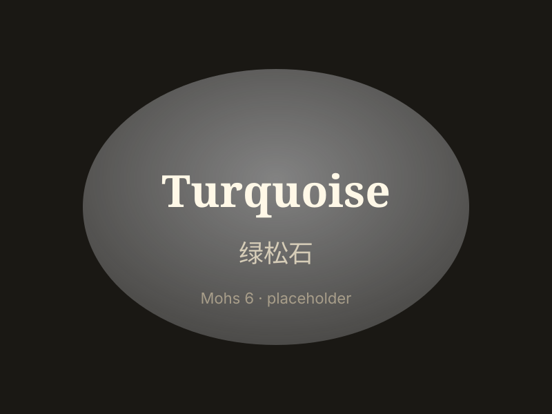

# 绿松石

> 含水铜铝磷酸盐

<!-- language switcher hint -->
English: [Turquoise](/gems/turquoise)

---

## 分类

| 属性 | 值 |
|---|---|
| 矿物族 | 含水铜铝磷酸盐 |
| 化学式 | CuAl₆(PO₄)₄(OH)₈·4H₂O |
| 晶系 | triclinic |

## 物理性质

| 属性 | 值 |
|---|---|
| 莫氏硬度 | 6 |
| 比重 | 2.7 |
| 折射率 | 1.61-1.65 |

## 光学性质

| 属性 | 值 |
|---|---|
| 多色性 | weak |
| 典型颜色 | 天空蓝, 蓝绿, 绿 |
| 致色原因 | 铜致蓝、铁致绿 |

## 处理与披露

| 处理方式 | 详情 |
|---------|------|
| 常见方法 | stabilisation, dyeing |
| 需披露 | 是 |
| 备注 | 高瓷蓝（睡美人矿）最贵；稳定处理常见 |

## 主要产地

| 产地 |
|---|
| 中国湖北 |
| 伊朗尼沙普尔 |
| 美国亚利桑那 |
| 墨西哥 |

## 历史与传说

绿松石是最古老宝石之一，古埃及法老、美国原住民、中国藏族均视为神圣护身符。

## 图库

