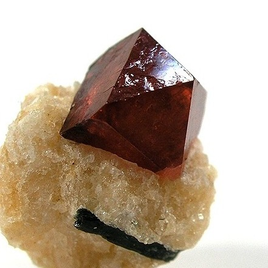
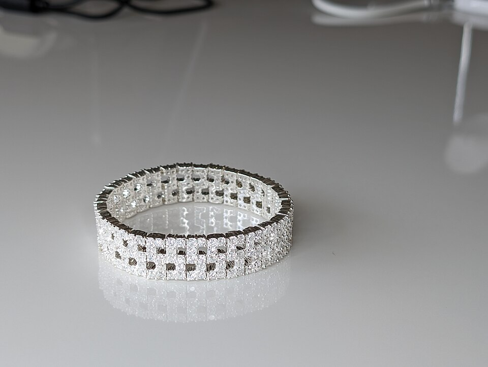
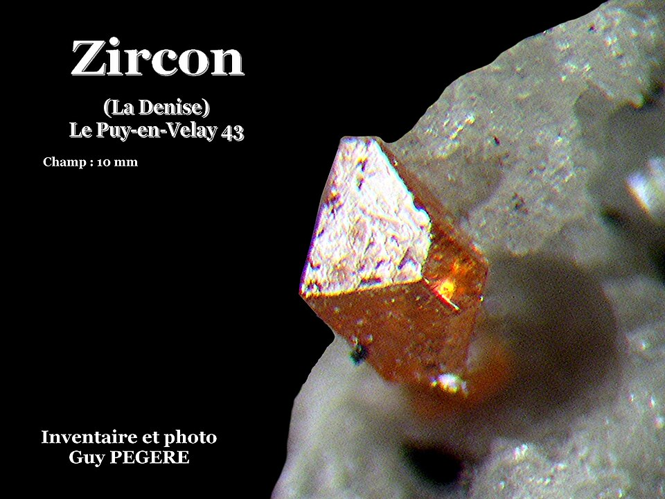
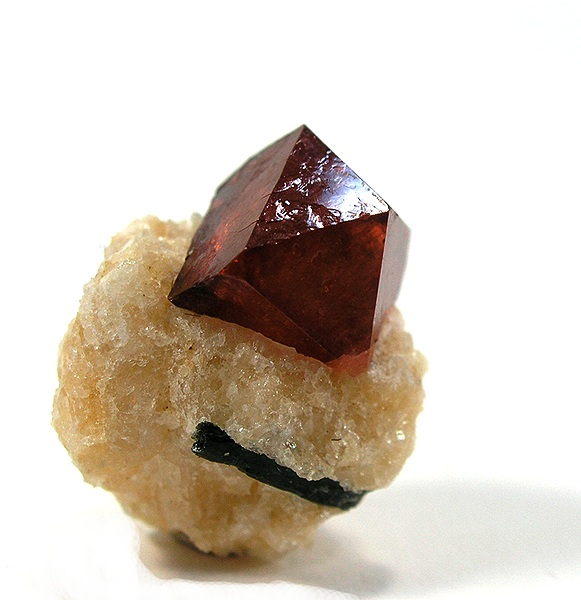

# 锆石

> 锆石族

<!-- language switcher hint -->
English: [Zircon](/gems/zircon)

---

## 分类

| 属性 | 值 |
|---|---|
| 矿物族 | 锆石族 |
| 化学式 | ZrSiO₄ |
| 晶系 | tetragonal |

## 物理性质

| 属性 | 值 |
|---|---|
| 莫氏硬度 | 7.25 |
| 比重 | 4.65 |
| 折射率 | 1.810-2.024 |

## 光学性质

| 属性 | 值 |
|---|---|
| 多色性 | weak |
| 典型颜色 | 蓝色（加热）, 金黄色, 无色, 蜂蜜色, 红色 |
| 致色原因 | U/Th 放射性损伤 + 过渡金属致色；天然蓝色稀少需加热 |

## 处理与披露

| 处理方式 | 详情 |
|---------|------|
| 常见方法 | heat-treatment |
| 需披露 | 是 |
| 备注 | 商业蓝色锆石多为褐黄色原石加热产物；与立方氧化锆（cz）完全不同 |

## 主要产地

| 产地 |
|---|
| 柬埔寨 |
| 斯里兰卡 |
| 泰国 |
| 澳大利亚 |

## 历史与传说

锆石是地球最古老矿物之一，含铀可测4亿年历史。蓝色热处理锆石曾风靡维多利亚时代。

## 图库

