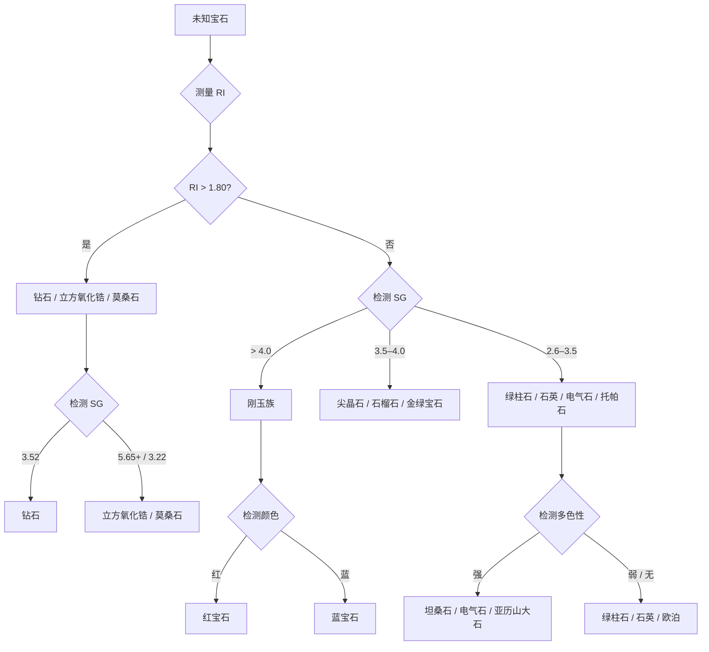

# 鉴定

> *宝石学者如何辨别一颗石头。*

鉴定是宝石学的核心技能。通过测量少数物理和光学性质，训练有素的宝石学者可以将任何天然宝石与其仿制品区分开来，并识别是否经过处理。

## 核心工具箱

四项测量构成宝石鉴定的基础：

| 测量项 | 揭示信息 | 典型范围 |
|--------|---------|---------|
| **折射率（RI）** | 光线进入宝石时的弯曲程度 | 1.37（欧泊）– 2.42（钻石） |
| **比重（SG）** | 相对于水的密度 | 2.10（欧泊）– 4.00（刚玉） |
| **莫氏硬度** | 耐刮擦能力 | 1（滑石）– 10（金刚石） |
| **双折射率（DR）** | 双折射差异 | 0.000（钻石）– 0.287（金红石） |

## 快速对照：关键宝石对比

<PropertyTable :gemIds="['ruby','sapphire','emerald','diamond','spinel','opal']" locale="zh" />

## 莫氏硬度尺

从最软（1）到最硬（10）的耐刮擦标准：

<MohsScale locale="zh" />

## 折射率

RI 是宝石鉴定中最可靠的单项测量。折射仪测量光进入宝石后减速和弯曲的程度。每个种类有特征范围：

| RI 范围 | 典型宝石 |
|---------|---------|
| 1.37–1.47 | 欧泊 |
| 1.54–1.55 | 石英（紫水晶、黄水晶） |
| 1.57–1.58 | 绿柱石（祖母绿、海蓝宝） |
| 1.61–1.67 | 电气石 |
| 1.71–1.76 | 尖晶石 |
| 1.74–1.76 | 石榴石（沙弗莱） |
| 1.76–1.77 | 刚玉（红宝石、蓝宝石） |
| 2.42 | 钻石 |

## 比重

SG 通过称量宝石在空气中和水中的重量得出。每个种类有恒定比值：

| SG | 典型宝石 |
|----|---------|
| 2.10 | 欧泊 |
| 2.65 | 石英 |
| 2.72 | 绿柱石 |
| 3.06 | 电气石 |
| 3.35 | 坦桑石 |
| 3.52 | 钻石 |
| 3.60 | 尖晶石 |
| 4.00 | 刚玉 |

## 多色性

许多有色宝石在不同方向上显示不同颜色，称为多色性。

| 强度 | 含义 | 示例 |
|------|------|------|
| **强** | 不同方向颜色明显不同 | 红宝石/蓝宝石（蓝/橙）、坦桑石（蓝/紫/红）、亚历山大石（绿/红）、电气石 |
| **弱** | 颜色细微变化 | 祖母绿 |
| **无** | 各方向颜色一致 | 钻石、尖晶石、石榴石 |

测试方法：用二色镜观察宝石并旋转。看到两到三种不同颜色即确认多色性。

## 内含物

内含物是大自然的指纹——识别宝石产地、区分天然与合成石的内部特征。

| 内含物类型 | 诊断意义 |
|-----------|---------|
| **针状金红石（丝绢）** | 缅甸红宝石、克什米尔蓝宝石 |
| **指纹状包体** | 红宝石、祖母绿中的愈合裂隙 |
| **羽状纹** | 钻石净度分级 |
| **三相包体** | 哥伦比亚祖母绿 |
| **色带** | 蓝宝石（颜色条带）、电气石 |
| **液/气泡** | 合成宝石、玻璃仿品 |

## 鉴定流程图

## 晶系参考

每种宝石在七种晶系之一（外加非晶质）中结晶。晶系影响光在宝石内部的行为。

<CrystalDiagram systemId="cubic" />
**等轴晶系** — 钻石、尖晶石、石榴石。单折射（无双折射）。

<CrystalDiagram systemId="tetragonal" />
**四方晶系** — 锆石、金红石。高双折射率。

<CrystalDiagram systemId="orthorhombic" />
**斜方晶系** — 坦桑石、亚历山大石、托帕石。三个不同的 RI 方向。

<CrystalDiagram systemId="hexagonal" />
**六方晶系** — 绿柱石（祖母绿、海蓝宝）。中等双折射。

<CrystalDiagram systemId="trigonal" />
**三方晶系** — 红宝石、蓝宝石、石英、电气石。强多色性。

<CrystalDiagram systemId="monoclinic" />
**单斜晶系** — 正长石、锂辉石。

<CrystalDiagram systemId="triclinic" />
**三斜晶系** — 蓝晶石、绿松石。
